# 01 — System Architecture Overview

Full-stack architecture of the Ghana Births & Deaths Registry (BDR) Digital Platform.

```mermaid
graph TB
    subgraph CLIENT["Client Layer (Browser)"]
        direction TB
        SPA["React 18 + Vite SPA"]
        A11Y["Accessibility Widget\n(WCAG 2.1 AA+)"]
        CHATBOT["Chatbot Widget\n(Gemini AI)"]
        WS_CLIENT["WebSocket Client\n(RealtimeNotifications.jsx)"]
        ROUTER["React Router v6\nLazy-loaded routes"]
    end

    subgraph CONTEXTS["React State (Context API)"]
        AUTH_CTX["AuthContext\nJWT, idle logout, refresh"]
        THEME_CTX["ThemeContext\ndark / light / system"]
        LANG_CTX["LanguageContext\ni18n — EN, Twi, Ga, Ewe"]
        SNACK_CTX["SnackbarContext\ntoast notifications"]
    end

    subgraph API_CLIENT["API Client (client.js)"]
        FETCH["Fetch Wrapper\n+ JWT injection"]
        CACHE["Response Cache\n45-second TTL"]
        REFRESH_INT["401 Interceptor\nauto-refresh token"]
    end

    subgraph GATEWAY["API Gateway — FastAPI :8000"]
        REST["REST API\n21 route modules"]
        WSS["WebSocket\n/api/notifications/ws"]
        DOCS["Swagger UI /docs\nReDoc /redoc"]
        AUDIT_MW["Audit Middleware\nIP + User Agent logging"]
        AUTH_MW["Auth Middleware\nJWT validation"]
    end

    subgraph SERVICES["Backend Services Layer"]
        AUTH_SVC["Auth Service\nregister, login, refresh, reset"]
        APP_SVC["Application Service\nbirth/death, tracking, status"]
        PAY_SVC["Payment Service\nPaystack integration"]
        CERT_SVC["Certificate Service\nPDF + QR generation"]
        NOTIF_SVC["Notification Service\nmulti-channel dispatch"]
        AI_SVC["AI Service\nClaude → Gemini fallback"]
        DOC_SVC["Document Service\nupload, verify"]
        ANALYTICS_SVC["Analytics Service\ncharts, heatmaps"]
        DELIVERY_SVC["Delivery Service\ncourier tracking"]
        AUDIT_SVC["Audit Service\nlog all actions"]
        CHATBOT_SVC["Chatbot Service\nGemini conversation"]
        PENALTY_SVC["Penalty Service\nlate registration fees"]
    end

    subgraph EXTERNAL["External Services"]
        PAYSTACK["Paystack\npayment processing"]
        ANTHROPIC["Anthropic Claude\nAI — haiku-4-5"]
        GEMINI["Google Gemini\nFlash 1.5 — fallback AI"]
        CLOUDINARY["Cloudinary CDN\ndocument & image storage"]
        GMAIL["Gmail SMTP\ntransactional email"]
        TWILIO["Twilio\nSMS notifications"]
        GOOGLE_OAUTH["Google OAuth 2.0\nsocial login"]
        NIA["NIA Ghana Card API\nidentity verification"]
    end

    subgraph DATA["Data Layer"]
        NEON["Neon PostgreSQL\nCloud Primary DB"]
        LOCAL_PG["Local PostgreSQL\nFallback DB"]
        ALEMBIC["Alembic Migrations\n7 migration versions"]
        CELERY["Celery + Redis\nBackground tasks"]
    end

    SPA --> ROUTER
    SPA --> AUTH_CTX
    SPA --> THEME_CTX
    SPA --> LANG_CTX
    SPA --> SNACK_CTX
    A11Y --> SPA
    CHATBOT --> API_CLIENT
    WS_CLIENT --> WSS

    ROUTER --> API_CLIENT
    API_CLIENT --> FETCH
    FETCH --> CACHE
    FETCH --> REFRESH_INT
    FETCH --> REST

    REST --> AUTH_MW
    REST --> AUDIT_MW
    AUTH_MW --> SERVICES
    AUDIT_MW --> AUDIT_SVC

    REST --> AUTH_SVC
    REST --> APP_SVC
    REST --> PAY_SVC
    REST --> CERT_SVC
    REST --> NOTIF_SVC
    REST --> AI_SVC
    REST --> DOC_SVC
    REST --> ANALYTICS_SVC
    REST --> CHATBOT_SVC

    PAY_SVC --> PAYSTACK
    AI_SVC --> ANTHROPIC
    AI_SVC -->|fallback| GEMINI
    CHATBOT_SVC --> GEMINI
    DOC_SVC --> CLOUDINARY
    NOTIF_SVC --> GMAIL
    NOTIF_SVC --> TWILIO
    AUTH_SVC --> GOOGLE_OAUTH
    AUTH_SVC --> NIA

    AUTH_SVC --> NEON
    APP_SVC --> NEON
    PAY_SVC --> NEON
    CERT_SVC --> NEON
    NOTIF_SVC --> NEON
    AUDIT_SVC --> NEON
    ANALYTICS_SVC --> NEON
    NEON -->|connection fail| LOCAL_PG
    ALEMBIC --> NEON
    NOTIF_SVC --> CELERY

    NOTIF_SVC --> WSS
    WSS --> WS_CLIENT
```

---

## Layer Descriptions

| Layer | Technology | Purpose |
|-------|-----------|---------|
| Client | React 18, Vite, React Router v6 | Single Page Application with lazy-loaded routes |
| State | Context API (4 contexts) | Auth, theme, i18n, toast notifications |
| API Client | Fetch API + custom wrapper | JWT injection, 45s cache, auto token refresh |
| API Gateway | FastAPI 0.100+ | 21 REST route modules + WebSocket endpoint |
| Services | Python business logic layer | Decoupled from routes for testability |
| Database | PostgreSQL (Neon cloud) | Primary with local fallback; 16 tables; Alembic migrations |
| Background | Celery + Redis | Async email dispatch, penalty calculation |
| External | Paystack, Claude, Gemini, Cloudinary, Twilio, Gmail | Payment, AI, storage, notifications |
