# 02 — Database Entity Relationship Diagram (ERD)

Full ERD for the Ghana BDR PostgreSQL database — 16 tables.

```mermaid
erDiagram
    USERS {
        int id PK
        string email UK
        string phone_number UK
        string hashed_password
        string first_name
        string last_name
        string other_names
        string ghana_card_number_encrypted UK
        string ghana_card_hash UK
        enum role "citizen|staff|admin|super_admin"
        enum status "active|inactive|suspended|pending_verification"
        enum kyc_status "unverified|pending|verified|rejected"
        bool is_active
        bool is_verified
        bool email_verified
        bool phone_verified
        string profile_photo
        string region
        string district
        text address
        bool notification_email
        bool notification_sms
        bool notification_push
        json accessibility_preferences
        datetime last_login
        datetime created_at
        datetime updated_at
    }

    STAFF_PROFILES {
        int id PK
        int user_id FK
        string staff_id UK
        string department
        string designation
        string office_location
        int supervisor_id FK
        bool can_approve
        bool can_reject
        bool can_print
        bool can_deliver
        datetime created_at
        datetime updated_at
    }

    APPLICATIONS {
        int id PK
        string reference_number UK
        int applicant_id FK
        int assigned_to_id FK
        int reviewed_by_id FK
        enum application_type "birth|death"
        enum status "draft|submitted|under_review|approved|rejected|payment_pending|payment_completed|processing|ready|collected|delivered|cancelled"
        enum service_plan "normal|express"
        json form_data
        string nationality
        string region
        string district
        string office_code
        bool is_late_registration
        int penalty_amount
        int processing_fee
        int total_fee
        text rejection_reason
        text review_notes
        datetime assigned_at
        text assignment_note
        datetime submitted_at
        datetime reviewed_at
        datetime approved_at
        datetime completed_at
        datetime created_at
        datetime updated_at
    }

    APPLICATION_STATUS_HISTORY {
        int id PK
        int application_id FK
        int changed_by_id FK
        string from_status
        string to_status
        text note
        datetime created_at
    }

    APPLICATION_CHATS {
        int id PK
        int application_id FK
        int sender_id FK
        text message
        bool is_read
        datetime created_at
    }

    DOCUMENTS {
        int id PK
        int application_id FK
        int uploaded_by_id FK
        string document_type
        string original_filename
        string file_url
        string cloudinary_public_id
        string mime_type
        int file_size_bytes
        bool is_verified
        string verification_notes
        int verified_by_id FK
        datetime created_at
    }

    PAYMENTS {
        int id PK
        int application_id FK
        int user_id FK
        string reference UK
        string paystack_reference
        decimal amount
        string currency
        enum status "pending|completed|failed|refunded"
        string payment_method
        string channel
        json metadata
        datetime paid_at
        datetime created_at
        datetime updated_at
    }

    CERTIFICATES {
        int id PK
        int application_id FK
        int issued_by_id FK
        string certificate_number UK
        string qr_code_url
        string pdf_url
        enum certificate_type "birth|death"
        string registrar_name
        string office_stamp
        bool is_valid
        string invalidation_reason
        datetime issued_at
        datetime created_at
    }

    NOTIFICATIONS {
        int id PK
        int user_id FK
        int application_id FK
        string title
        text message
        string notification_type
        enum channel "in_app|email|sms"
        enum status "unread|read"
        json data
        datetime read_at
        datetime created_at
    }

    AUDIT_LOGS {
        int id PK
        int user_id FK
        int application_id FK
        string action
        string entity_type
        int entity_id
        json changes
        string ip_address
        string user_agent
        datetime created_at
    }

    PENALTIES {
        int id PK
        int application_id FK
        enum penalty_type "late_birth|late_death"
        int days_late
        decimal penalty_amount
        bool is_waived
        string waiver_reason
        int waived_by_id FK
        datetime waived_at
        datetime created_at
    }

    DELIVERIES {
        int id PK
        int application_id FK
        int assigned_to_id FK
        enum status "pending|in_transit|delivered|failed"
        string delivery_address
        string tracking_code UK
        text delivery_notes
        datetime scheduled_at
        datetime delivered_at
        datetime created_at
        datetime updated_at
    }

    DELIVERY_TRACKING_EVENTS {
        int id PK
        int delivery_id FK
        string location
        string status_note
        datetime event_time
    }

    REFRESH_TOKENS {
        int id PK
        int user_id FK
        string token UK
        datetime expires_at
        bool is_revoked
        datetime created_at
    }

    EMAIL_VERIFICATION_TOKENS {
        int id PK
        int user_id FK
        string token UK
        bool is_used
        datetime expires_at
        datetime created_at
    }

    PASSWORD_RESET_TOKENS {
        int id PK
        int user_id FK
        string token UK
        bool is_used
        datetime expires_at
        datetime created_at
    }

    GHANA_CARD_RECORDS {
        int id PK
        string ghana_card_number UK
        string first_name
        string last_name
        string date_of_birth
        string region
        datetime created_at
    }

    STATISTICS_REQUESTS {
        int id PK
        int user_id FK
        string organisation_name
        string purpose
        json requested_data
        enum status "pending|approved|rejected"
        int approved_by_id FK
        datetime created_at
    }

    CONTACT_SUBMISSIONS {
        int id PK
        string name
        string email
        string phone
        string subject
        text message
        bool is_resolved
        datetime created_at
    }

    USERS ||--o{ APPLICATIONS : "applicant_id"
    USERS ||--o| STAFF_PROFILES : "user_id"
    USERS ||--o{ REFRESH_TOKENS : "user_id"
    USERS ||--o{ EMAIL_VERIFICATION_TOKENS : "user_id"
    USERS ||--o{ PASSWORD_RESET_TOKENS : "user_id"
    USERS ||--o{ NOTIFICATIONS : "user_id"
    USERS ||--o{ AUDIT_LOGS : "user_id"
    USERS ||--o{ PAYMENTS : "user_id"
    USERS ||--o{ STATISTICS_REQUESTS : "user_id"
    STAFF_PROFILES }o--o| USERS : "supervisor_id"
    APPLICATIONS ||--o{ DOCUMENTS : "application_id"
    APPLICATIONS ||--o| PAYMENTS : "application_id"
    APPLICATIONS ||--o| CERTIFICATES : "application_id"
    APPLICATIONS ||--o{ NOTIFICATIONS : "application_id"
    APPLICATIONS ||--o{ AUDIT_LOGS : "application_id"
    APPLICATIONS ||--o| PENALTIES : "application_id"
    APPLICATIONS ||--o| DELIVERIES : "application_id"
    APPLICATIONS ||--o{ APPLICATION_CHATS : "application_id"
    APPLICATIONS ||--o{ APPLICATION_STATUS_HISTORY : "application_id"
    APPLICATIONS }o--o| USERS : "assigned_to_id"
    APPLICATIONS }o--o| USERS : "reviewed_by_id"
    APPLICATION_CHATS }o--|| USERS : "sender_id"
    APPLICATION_STATUS_HISTORY }o--|| USERS : "changed_by_id"
    CERTIFICATES }o--|| USERS : "issued_by_id"
    DOCUMENTS }o--o| USERS : "verified_by_id"
    PENALTIES }o--o| USERS : "waived_by_id"
    DELIVERIES }o--o| USERS : "assigned_to_id"
    DELIVERIES ||--o{ DELIVERY_TRACKING_EVENTS : "delivery_id"
```

---

## Table Count Summary

| Category | Tables |
|----------|--------|
| Core Identity | USERS, STAFF_PROFILES |
| Tokens / Auth | REFRESH_TOKENS, EMAIL_VERIFICATION_TOKENS, PASSWORD_RESET_TOKENS |
| Registration | APPLICATIONS, APPLICATION_STATUS_HISTORY, APPLICATION_CHATS |
| Documents | DOCUMENTS |
| Payments | PAYMENTS |
| Certificates | CERTIFICATES |
| Notifications | NOTIFICATIONS |
| Delivery | DELIVERIES, DELIVERY_TRACKING_EVENTS |
| Financial | PENALTIES |
| Audit | AUDIT_LOGS |
| External | GHANA_CARD_RECORDS, STATISTICS_REQUESTS, CONTACT_SUBMISSIONS |
