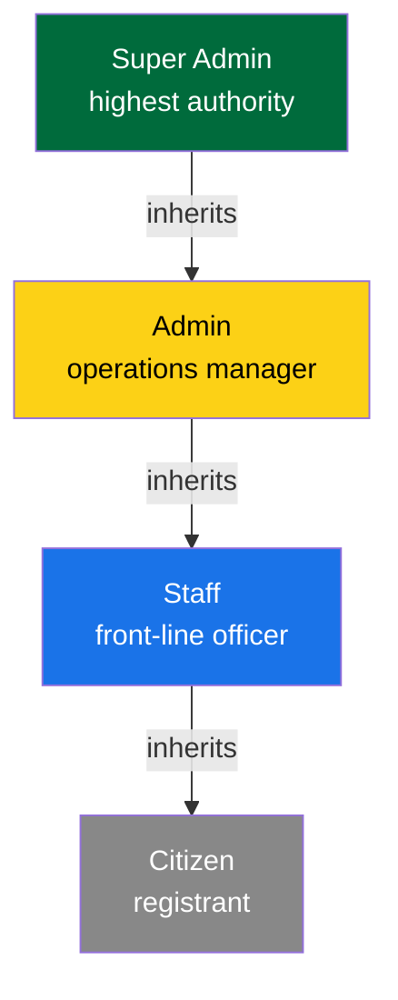
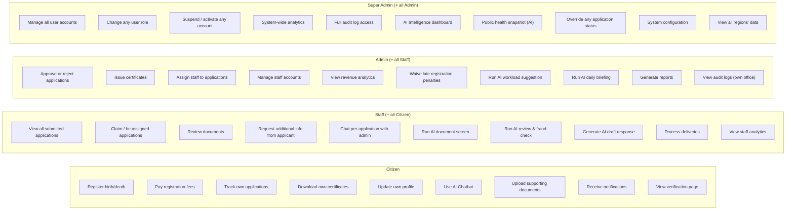
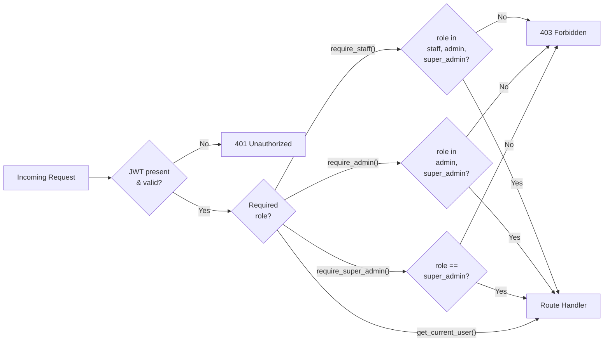

# 03 — User Roles & Permissions

Role-Based Access Control (RBAC) hierarchy for the Ghana BDR platform.

## Role Hierarchy

```mermaid
graph TB
    SA["Super Admin\nhighest authority"]
    AD["Admin\noperations manager"]
    ST["Staff\nfront-line officer"]
    CI["Citizen\nregistrant"]

    SA -->|inherits| AD
    AD -->|inherits| ST
    ST -->|inherits| CI

    style SA fill:#006B3C,color:#fff
    style AD fill:#FCD116,color:#000
    style ST fill:#1a73e8,color:#fff
    style CI fill:#888,color:#fff
```

---

## Permissions Matrix

```mermaid
graph LR
    subgraph CITIZEN["Citizen"]
        C1["Register birth/death"]
        C2["Pay registration fees"]
        C3["Track own applications"]
        C4["Download own certificates"]
        C5["Update own profile"]
        C6["Use AI Chatbot"]
        C7["Upload supporting documents"]
        C8["Receive notifications"]
        C9["View verification page"]
    end

    subgraph STAFF["Staff (+ all Citizen)"]
        S1["View all submitted applications"]
        S2["Claim / be assigned applications"]
        S3["Review documents"]
        S4["Request additional info from applicant"]
        S5["Chat per-application with admin"]
        S6["Run AI document screen"]
        S7["Run AI review & fraud check"]
        S8["Generate AI draft response"]
        S9["Process deliveries"]
        S10["View staff analytics"]
    end

    subgraph ADMIN["Admin (+ all Staff)"]
        A1["Approve or reject applications"]
        A2["Issue certificates"]
        A3["Assign staff to applications"]
        A4["Manage staff accounts"]
        A5["View revenue analytics"]
        A6["Waive late registration penalties"]
        A7["Run AI workload suggestion"]
        A8["Run AI daily briefing"]
        A9["Generate reports"]
        A10["View audit logs (own office)"]
    end

    subgraph SUPER_ADMIN["Super Admin (+ all Admin)"]
        SA1["Manage all user accounts"]
        SA2["Change any user role"]
        SA3["Suspend / activate any account"]
        SA4["System-wide analytics"]
        SA5["Full audit log access"]
        SA6["AI Intelligence dashboard"]
        SA7["Public health snapshot (AI)"]
        SA8["Override any application status"]
        SA9["System configuration"]
        SA10["View all regions' data"]
    end
```

---

## API Route Guards

```mermaid
flowchart LR
    REQ["Incoming Request"] --> JWT{JWT present\n& valid?}
    JWT -->|No| 401["401 Unauthorized"]
    JWT -->|Yes| ROLE{Required\nrole?}

    ROLE -->|"require_staff()"| STAFF_CHECK{role in\nstaff, admin,\nsuper_admin?}
    STAFF_CHECK -->|No| 403["403 Forbidden"]
    STAFF_CHECK -->|Yes| HANDLER["Route Handler"]

    ROLE -->|"require_admin()"| ADMIN_CHECK{role in\nadmin,\nsuper_admin?}
    ADMIN_CHECK -->|No| 403
    ADMIN_CHECK -->|Yes| HANDLER

    ROLE -->|"require_super_admin()"| SA_CHECK{role ==\nsuper_admin?}
    SA_CHECK -->|No| 403
    SA_CHECK -->|Yes| HANDLER

    ROLE -->|"get_current_user()"| HANDLER
```
