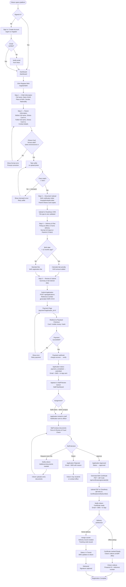

# 04 — Birth Registration Flowchart

End-to-end user journey for registering a birth on the Ghana BDR platform.

```mermaid
flowchart TD
    START([Citizen opens platform]) --> AUTH{Signed in?}
    AUTH -->|No| SIGNIN["Sign In / Create Account\n/signin or /register"]
    AUTH -->|Yes| DASH["Dashboard\n/dashboard"]
    SIGNIN --> EMAIL_VERIFY{Email\nverified?}
    EMAIL_VERIFY -->|No| VERIFY_EMAIL["Verify email\nfrom inbox"]
    VERIFY_EMAIL --> DASH
    EMAIL_VERIFY -->|Yes| DASH

    DASH --> BEGIN["Click Register Birth\n/register/birth"]
    BEGIN --> STEP1["Step 1 — Child Information\nFull name, Date of birth\nPlace of birth, Gender, Nationality"]

    STEP1 --> STEP2["Step 2 — Parent Information\nMother full name, Ghana Card no.\nFather full name, Ghana Card no.\nContact details"]

    STEP2 --> GC_CHECK{Ghana Card\nformat valid?\nGHA-XXXXXXXXX-X}
    GC_CHECK -->|No| GC_ERROR["Show format error\nPrompt correction"]
    GC_ERROR --> STEP2
    GC_CHECK -->|Yes| SELFIE["Take selfie\nor upload photo"]
    SELFIE --> FACE_CHECK{Face match\n> 70%?}
    FACE_CHECK -->|No — mismatch| RETRY_FACE["Show mismatch error\nRetry selfie"]
    RETRY_FACE --> SELFIE
    FACE_CHECK -->|Yes| STEP3["Step 3 — Document Upload\nBirth notification letter\nHospital/midwife letter\nParent Ghana Card copies"]

    STEP3 --> CLOUD["Upload to Cloudinary CDN\nFile type & size validated"]
    CLOUD --> STEP4["Step 4 — Delivery & Plan\nPickup at office or home delivery\nNormal (10 days) or Express (3 days)"]

    STEP4 --> LATE{Birth date\n> 12 months ago?}
    LATE -->|Yes| PENALTY["Calculate late penalty\nGHS amount added"]
    LATE -->|No| FEE["Standard fee\nbirth registration fee"]
    PENALTY --> REVIEW
    FEE --> REVIEW["Step 5 — Review & Submit\nSummary of all entered data"]

    REVIEW --> SUBMIT["Submit Application\nPOST /api/applications\nReference number generated: BDR-XXXX"]

    SUBMIT --> PAY_PAGE["Payment Page\n/payment?application_id=X"]
    PAY_PAGE --> PAYSTACK["Redirect to Paystack Checkout\nCard / mobile money / bank"]
    PAYSTACK --> PAY_DONE{Payment\nsucceeded?}
    PAY_DONE -->|No| PAY_ERR["Show error\nRetry payment"]
    PAY_ERR --> PAY_PAGE
    PAY_DONE -->|Yes| WEBHOOK["Paystack webhook\ncharge.success → verify"]
    WEBHOOK --> APP_STATUS["Application status:\npayment_completed → submitted\nEmail + SMS + In-App sent"]

    APP_STATUS --> STAFF_QUEUE["Appears in Staff Review Queue\nStaff Dashboard"]
    STAFF_QUEUE --> ASSIGN{Assignment?}
    ASSIGN -->|Admin assigns| LOCKED["Application locked to staff\nNotification sent to officer"]
    ASSIGN -->|Staff claims| LOCKED
    LOCKED --> REVIEW_DOCS["Staff reviews documents\nRuns AI Review & Fraud Check"]

    REVIEW_DOCS --> DECISION{Staff decision}
    DECISION -->|"Request more info"| MORE_INFO["Notify citizen:\nAdditional documents needed"]
    MORE_INFO --> UPLOAD_MORE["Citizen uploads extra documents"]
    UPLOAD_MORE --> REVIEW_DOCS

    DECISION -->|Reject| REJECTED["Application Rejected\nEmail + SMS with reason"]
    REJECTED --> APPEAL["Citizen may resubmit\nor contact office"]

    DECISION -->|Approve| APPROVED["Application Approved\nStatus → approved"]
    APPROVED --> CERT_GEN["Generate Birth Certificate\nPDF + QR Code\n/api/certificates/generate/{id}"]
    CERT_GEN --> UPLOAD_CERT["Upload PDF to Cloudinary\nQR links to /certificates/verify/{number}"]
    UPLOAD_CERT --> NOTIFY_CERT["Notify citizen:\nCertificate ready\nEmail + SMS + In-App"]

    NOTIFY_CERT --> DELIVERY{Delivery\npreference}
    DELIVERY -->|"Office pickup"| READY["Certificate marked Ready\nCitizen collects at BDR office"]
    DELIVERY -->|"Home delivery"| COURIER["Assign courier\nDelivery record created\nTracking code issued"]
    COURIER --> IN_TRANSIT["Status: In Transit\nSMS updates to citizen"]
    IN_TRANSIT --> DELIVERED["Delivered\nSignature captured"]

    READY --> COLLECT["Citizen collects\nPresents ID + reference number"]
    COLLECT --> DONE([Registration Complete])
    DELIVERED --> DONE
```
