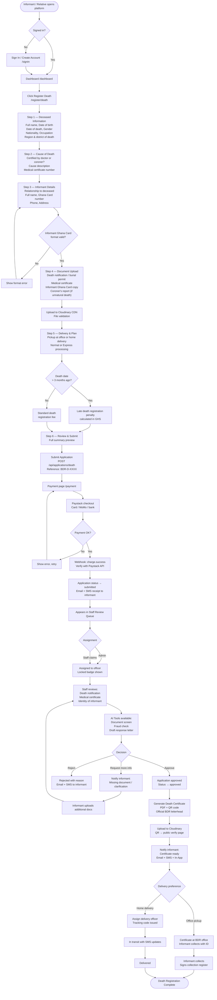

# 05 — Death Registration Flowchart

End-to-end journey for registering a death on the Ghana BDR platform.

```mermaid
flowchart TD
    START([Informant / Relative opens platform]) --> AUTH{Signed in?}
    AUTH -->|No| SIGNIN["Sign In / Create Account\n/signin"]
    AUTH -->|Yes| DASH["Dashboard /dashboard"]
    SIGNIN --> DASH

    DASH --> BEGIN["Click Register Death\n/register/death"]

    BEGIN --> D1["Step 1 — Deceased Information\nFull name, Date of birth\nDate of death, Gender\nNationality, Occupation\nRegion & district of death"]

    D1 --> D2["Step 2 — Cause of Death\nCertified by doctor or coroner?\nCause description\nMedical certificate number"]

    D2 --> D3["Step 3 — Informant Details\nRelationship to deceased\nFull name, Ghana Card number\nPhone, Address"]

    D3 --> GC_CHECK{Informant Ghana Card\nformat valid?}
    GC_CHECK -->|No| GC_ERR["Show format error"]
    GC_ERR --> D3
    GC_CHECK -->|Yes| D4["Step 4 — Document Upload\nDeath notification / burial permit\nMedical certificate\nInformant Ghana Card copy\nCoroner's report (if unnatural death)"]

    D4 --> CLOUD["Upload to Cloudinary CDN\nFile validation"]

    CLOUD --> D5["Step 5 — Delivery & Plan\nPickup at office or home delivery\nNormal or Express processing"]

    D5 --> LATE{Death date\n> 3 months ago?}
    LATE -->|Yes| PENALTY["Late death registration penalty\ncalculated in GHS"]
    LATE -->|No| FEE["Standard death\nregistration fee"]
    PENALTY --> REVIEW
    FEE --> REVIEW["Step 6 — Review & Submit\nFull summary preview"]

    REVIEW --> SUBMIT["Submit Application\nPOST /api/applications/death\nReference: BDR-D-XXXX"]

    SUBMIT --> PAY_PAGE["Payment page /payment"]
    PAY_PAGE --> PAYSTACK["Paystack checkout\nCard / MoMo / bank"]
    PAYSTACK --> PAY_CHECK{Payment OK?}
    PAY_CHECK -->|No| PAY_RETRY["Show error, retry"]
    PAY_RETRY --> PAY_PAGE
    PAY_CHECK -->|Yes| WEBHOOK["Webhook: charge.success\nVerify with Paystack API"]

    WEBHOOK --> STATUS_UPDATE["Application status → submitted\nEmail + SMS receipt to informant"]
    STATUS_UPDATE --> STAFF_QUEUE["Appears in Staff Review Queue"]

    STAFF_QUEUE --> ASSIGN{Assignment}
    ASSIGN -->|Admin| LOCKED["Assigned to officer\nLocked badge shown"]
    ASSIGN -->|Staff claims| LOCKED

    LOCKED --> REVIEW_DOCS["Staff reviews:\nDeath notification\nMedical certificate\nIdentity of informant"]

    REVIEW_DOCS --> AI["AI Tools available:\nDocument screen\nFraud check\nDraft response letter"]

    AI --> DECISION{Decision}
    DECISION -->|"Request more info"| REQUEST["Notify informant:\nMissing document / clarification"]
    REQUEST --> UPLOAD_MORE["Informant uploads additional docs"]
    UPLOAD_MORE --> REVIEW_DOCS

    DECISION -->|Reject| REJECTED["Rejected with reason\nEmail + SMS to informant"]

    DECISION -->|Approve| APPROVED["Application approved\nStatus → approved"]
    APPROVED --> CERT["Generate Death Certificate\nPDF + QR code\nOfficial BDR letterhead"]
    CERT --> UPLOAD_CERT["Upload to Cloudinary\nQR → public verify page"]
    UPLOAD_CERT --> NOTIFY["Notify informant:\nCertificate ready\nEmail + SMS + In-App"]

    NOTIFY --> DEL{Delivery preference}
    DEL -->|Office pickup| READY["Certificate at BDR office\nInformant collects with ID"]
    DEL -->|Home delivery| COURIER["Assign delivery officer\nTracking code issued"]
    COURIER --> TRANSIT["In transit with SMS updates"]
    TRANSIT --> DONE_DEL["Delivered"]

    READY --> COLLECT["Informant collects\nSigns collection register"]
    COLLECT --> DONE([Death Registration Complete])
    DONE_DEL --> DONE
```
