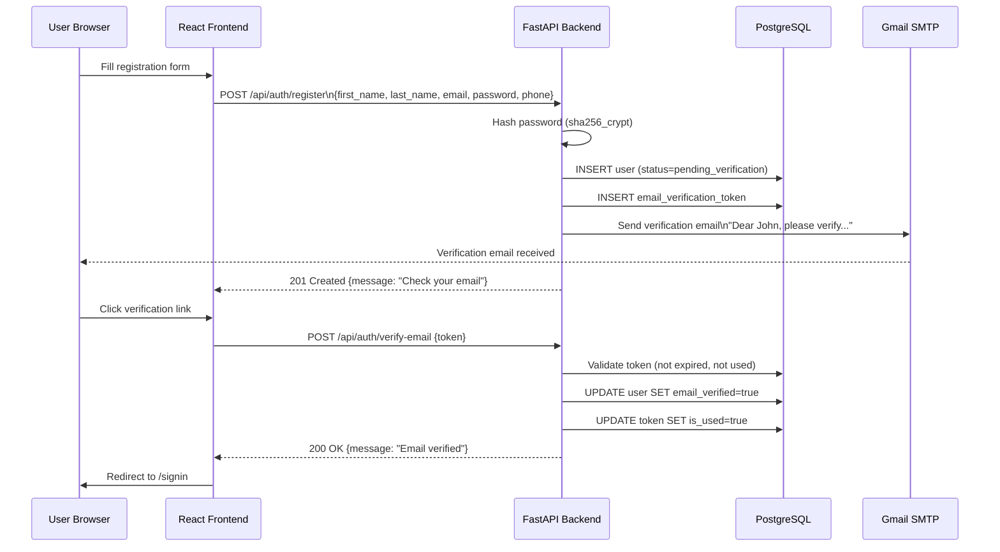
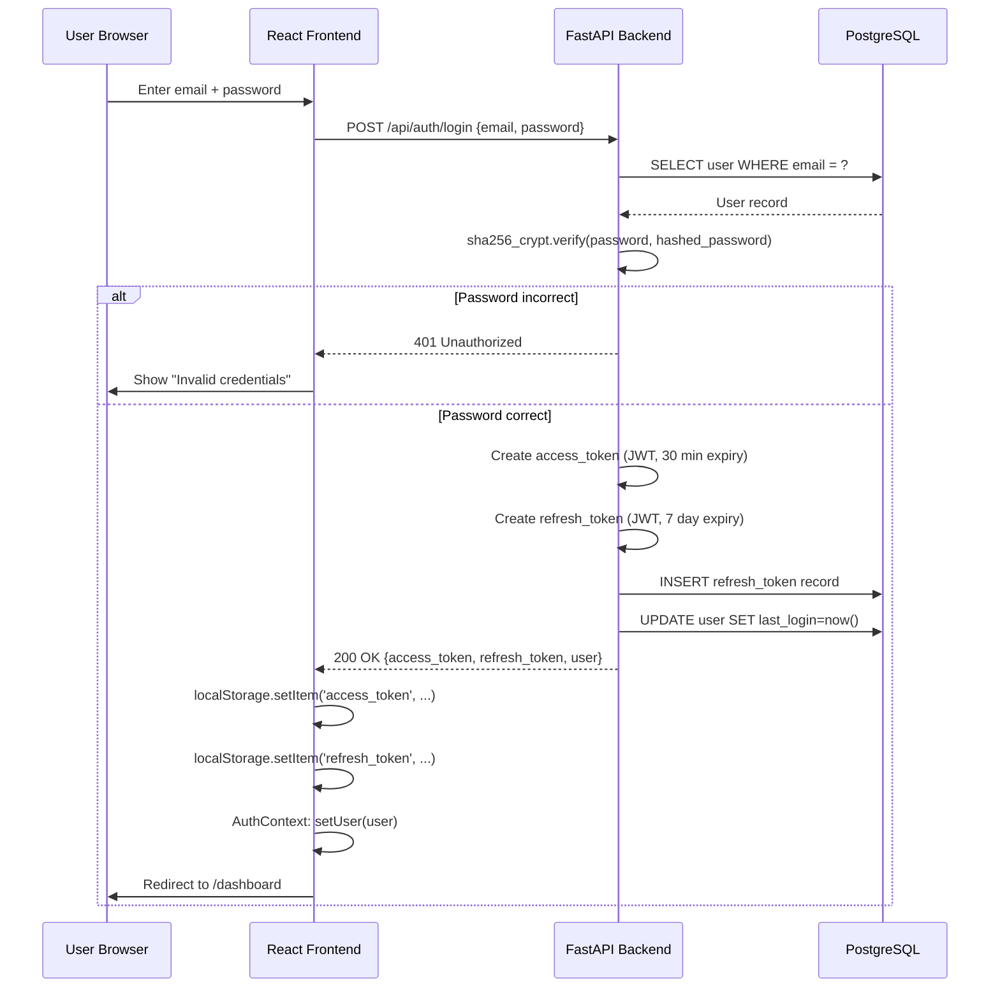
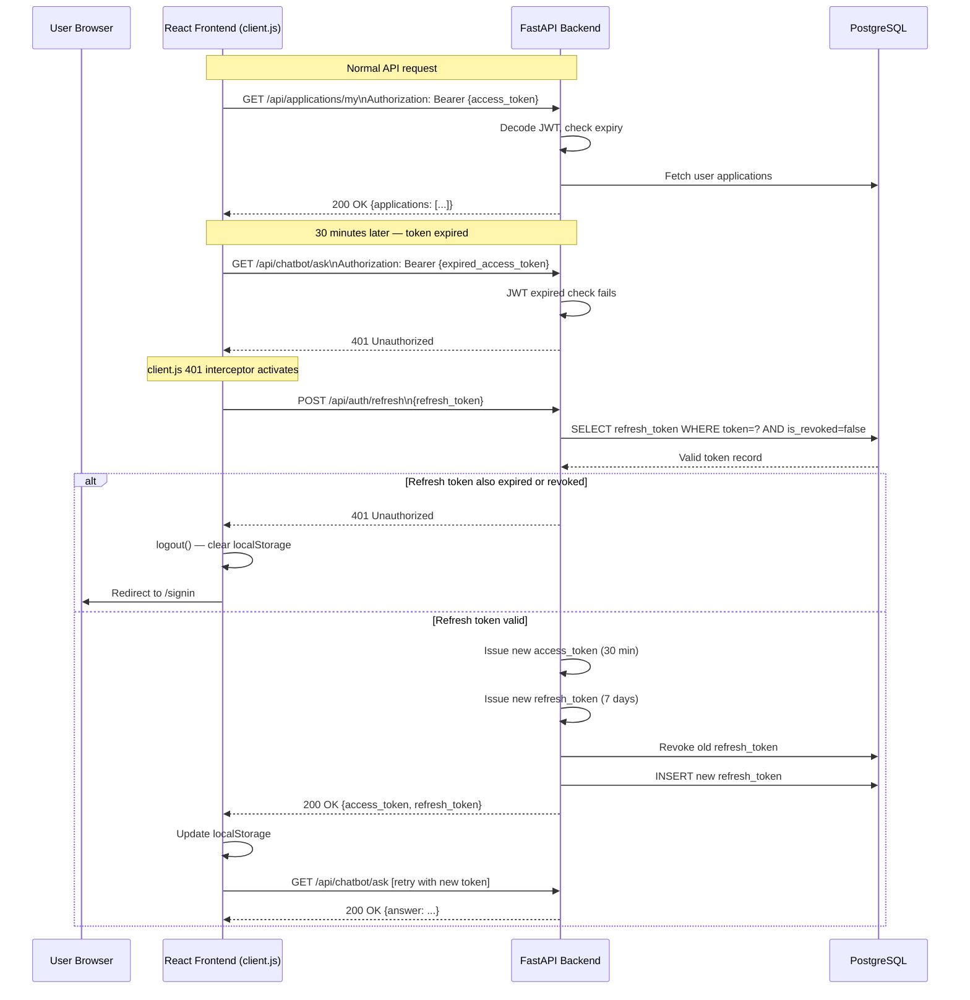
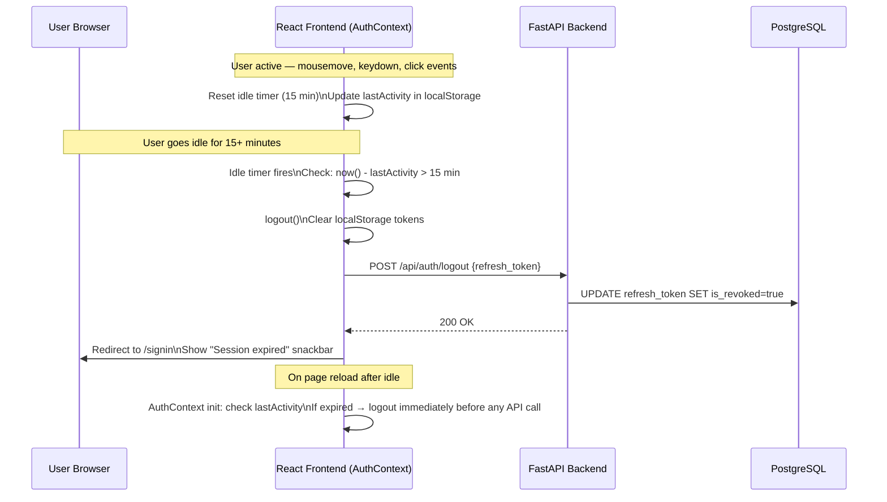
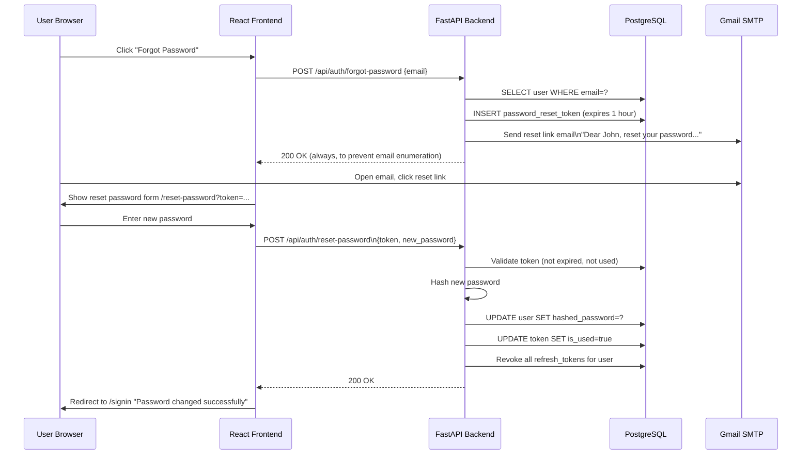

# 06 — Authentication & Token Lifecycle

JWT-based authentication with automatic token refresh and idle session logout.

## Registration & Email Verification

---

## Login & Token Issuance

---

## Authenticated API Call & Auto Token Refresh

---

## Idle Session Logout

---

## Password Reset Flow

