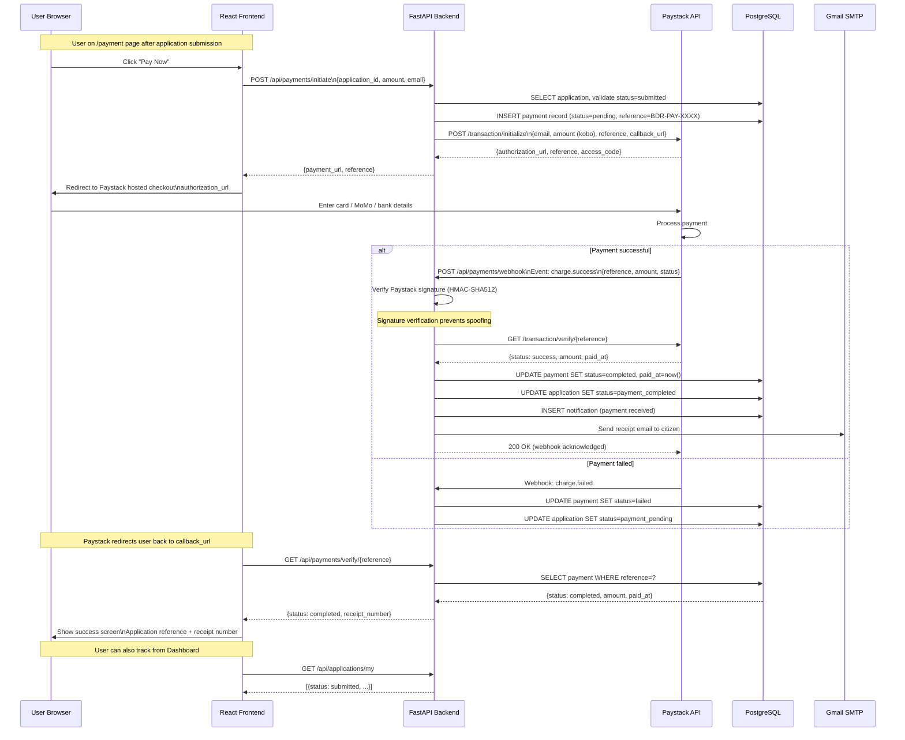
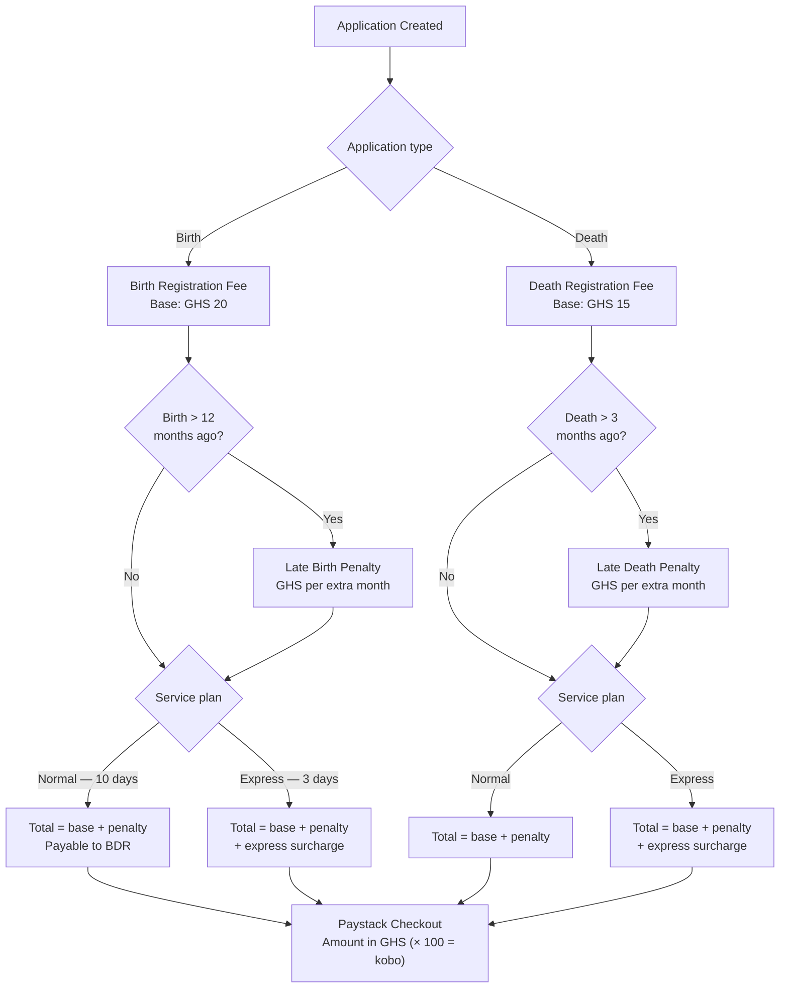

# 07 — Payment Integration Flow (Paystack)

Full payment lifecycle — initiation, checkout, webhook verification, and receipt.

```mermaid
sequenceDiagram
    participant U as User Browser
    participant FE as React Frontend
    participant API as FastAPI Backend
    participant PS as Paystack API
    participant DB as PostgreSQL
    participant EMAIL as Gmail SMTP

    Note over U,FE: User on /payment page after application submission

    U->>FE: Click "Pay Now"
    FE->>API: POST /api/payments/initiate\n{application_id, amount, email}
    API->>DB: SELECT application, validate status=submitted
    API->>DB: INSERT payment record (status=pending, reference=BDR-PAY-XXXX)
    API->>PS: POST /transaction/initialize\n{email, amount (kobo), reference, callback_url}
    PS-->>API: {authorization_url, reference, access_code}
    API-->>FE: {payment_url, reference}

    FE->>U: Redirect to Paystack hosted checkout\nauthorization_url

    U->>PS: Enter card / MoMo / bank details
    PS->>PS: Process payment

    alt Payment successful
        PS->>API: POST /api/payments/webhook\nEvent: charge.success\n{reference, amount, status}
        API->>API: Verify Paystack signature (HMAC-SHA512)

        Note over API: Signature verification prevents spoofing
        API->>PS: GET /transaction/verify/{reference}
        PS-->>API: {status: success, amount, paid_at}
        API->>DB: UPDATE payment SET status=completed, paid_at=now()
        API->>DB: UPDATE application SET status=payment_completed
        API->>DB: INSERT notification (payment received)
        API->>EMAIL: Send receipt email to citizen
        API-->>PS: 200 OK (webhook acknowledged)
    else Payment failed
        PS->>API: Webhook: charge.failed
        API->>DB: UPDATE payment SET status=failed
        API->>DB: UPDATE application SET status=payment_pending
    end

    Note over U,FE: Paystack redirects user back to callback_url

    FE->>API: GET /api/payments/verify/{reference}
    API->>DB: SELECT payment WHERE reference=?
    DB-->>API: {status: completed, amount, paid_at}
    API-->>FE: {status: completed, receipt_number}

    FE->>U: Show success screen\nApplication reference + receipt number

    Note over FE,U: User can also track from Dashboard
    FE->>API: GET /api/applications/my
    API-->>FE: [{status: submitted, ...}]
```

---

## Fee Calculation

```mermaid
flowchart TD
    APP["Application Created"] --> TYPE{Application type}
    TYPE -->|Birth| BIRTH_FEE["Birth Registration Fee\nBase: GHS 20"]
    TYPE -->|Death| DEATH_FEE["Death Registration Fee\nBase: GHS 15"]

    BIRTH_FEE --> LATE_B{Birth > 12\nmonths ago?}
    DEATH_FEE --> LATE_D{Death > 3\nmonths ago?}

    LATE_B -->|Yes| BIRTH_PENALTY["Late Birth Penalty\nGHS per extra month"]
    LATE_B -->|No| PLAN_B
    LATE_D -->|Yes| DEATH_PENALTY["Late Death Penalty\nGHS per extra month"]
    LATE_D -->|No| PLAN_D

    BIRTH_PENALTY --> PLAN_B{Service plan}
    DEATH_PENALTY --> PLAN_D{Service plan}

    PLAN_B -->|Normal — 10 days| TOTAL_B["Total = base + penalty\nPayable to BDR"]
    PLAN_B -->|Express — 3 days| EXPRESS_B["Total = base + penalty\n+ express surcharge"]
    PLAN_D -->|Normal| TOTAL_D["Total = base + penalty"]
    PLAN_D -->|Express| EXPRESS_D["Total = base + penalty\n+ express surcharge"]

    TOTAL_B --> PAYMENT["Paystack Checkout\nAmount in GHS (× 100 = kobo)"]
    EXPRESS_B --> PAYMENT
    TOTAL_D --> PAYMENT
    EXPRESS_D --> PAYMENT
```
