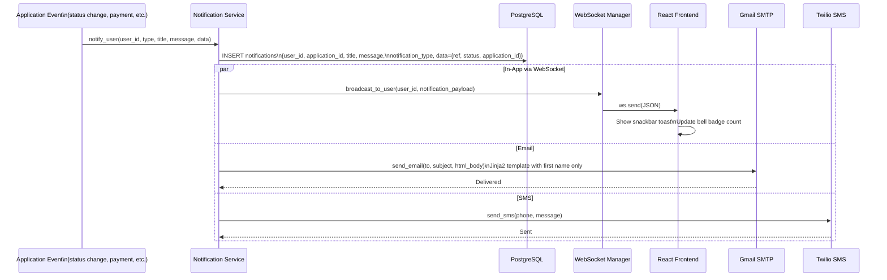
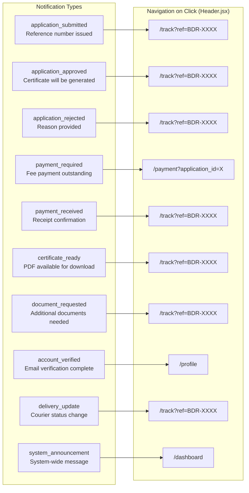
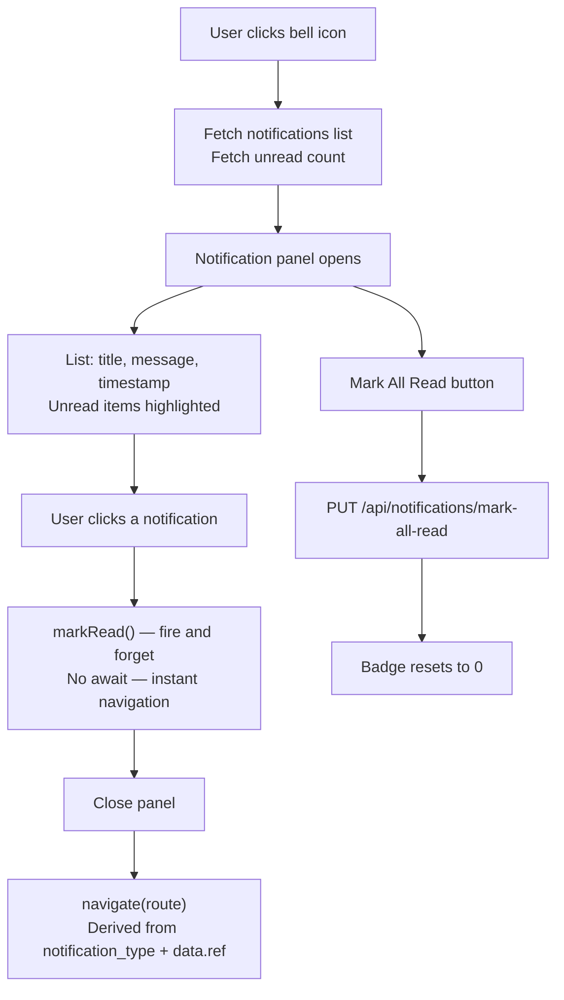
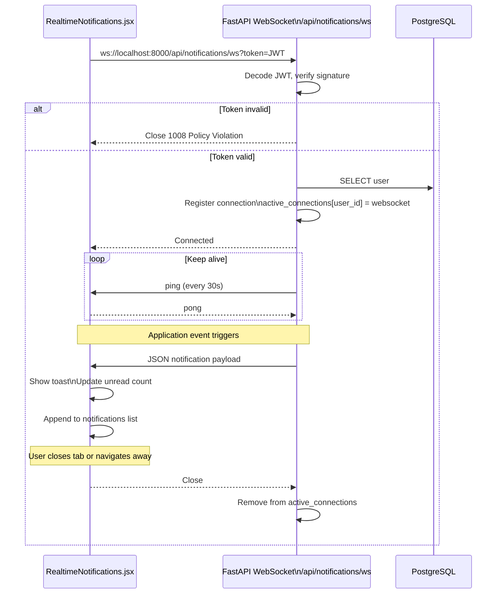

# 08 — Notification System

Multi-channel notification architecture — in-app, email, SMS, and real-time WebSocket.

## Notification Dispatch Flow

---

## Notification Types & Navigation Routes

---

## Notification Panel UX (Header.jsx)

---

## WebSocket Connection Lifecycle

