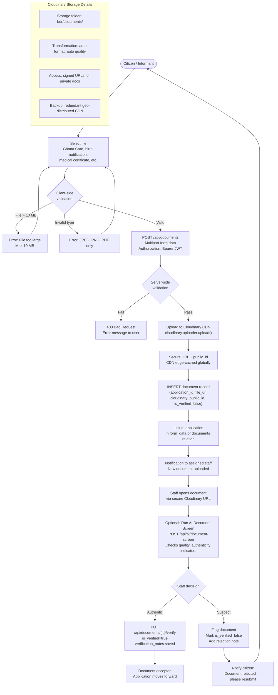

# 09 — Document Upload & Verification Flow

Document lifecycle from upload by citizen to staff verification.

---

## Document Types

| Document | Required For | Accepted Formats |
|----------|-------------|-----------------|
| Ghana Card (parent/informant) | Birth & Death | JPEG, PNG, PDF |
| Birth Notification Letter | Birth | PDF, JPEG, PNG |
| Hospital / Midwife Letter | Birth | PDF |
| Death Notification / Burial Permit | Death | PDF, JPEG, PNG |
| Medical Certificate of Death | Death | PDF |
| Coroner's Report | Death (unnatural) | PDF |
| Passport Photo | Both | JPEG, PNG |
