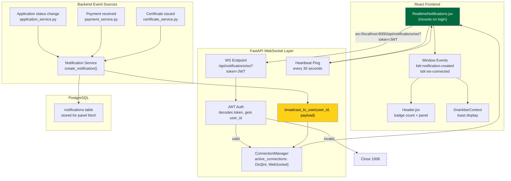
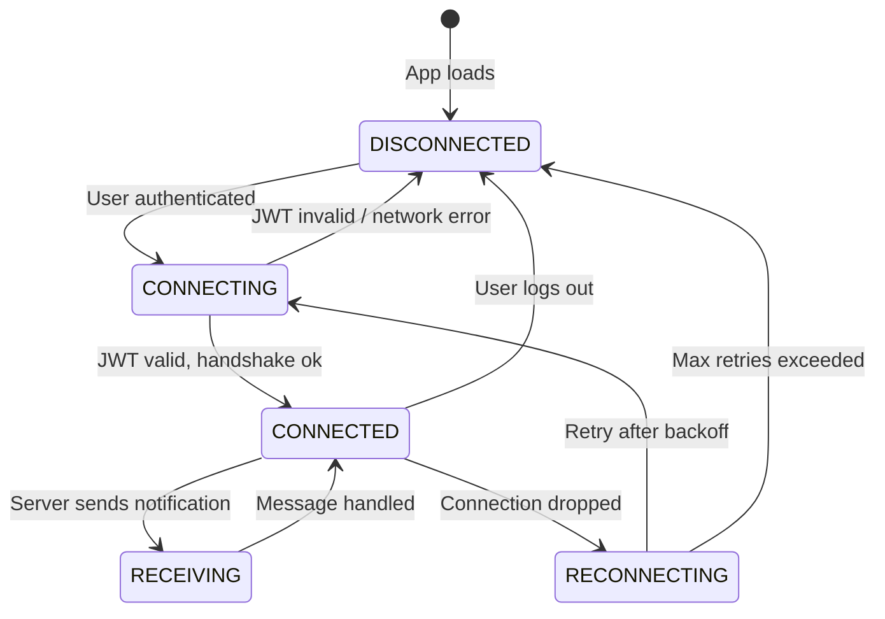

# 10 — WebSocket Real-Time Architecture

Real-time notification delivery using WebSockets (FastAPI + React).



---

## Connection State Machine



---

## Broadcast Payload Structure

```json
{
  "id": 42,
  "title": "Application Approved",
  "message": "Your application BDR-2026-0042 has been approved.",
  "notification_type": "application_approved",
  "status": "unread",
  "application_id": 17,
  "data": {
    "ref": "BDR-2026-0042",
    "status": "approved",
    "application_id": 17
  },
  "created_at": "2026-03-28T10:15:30Z"
}
```
