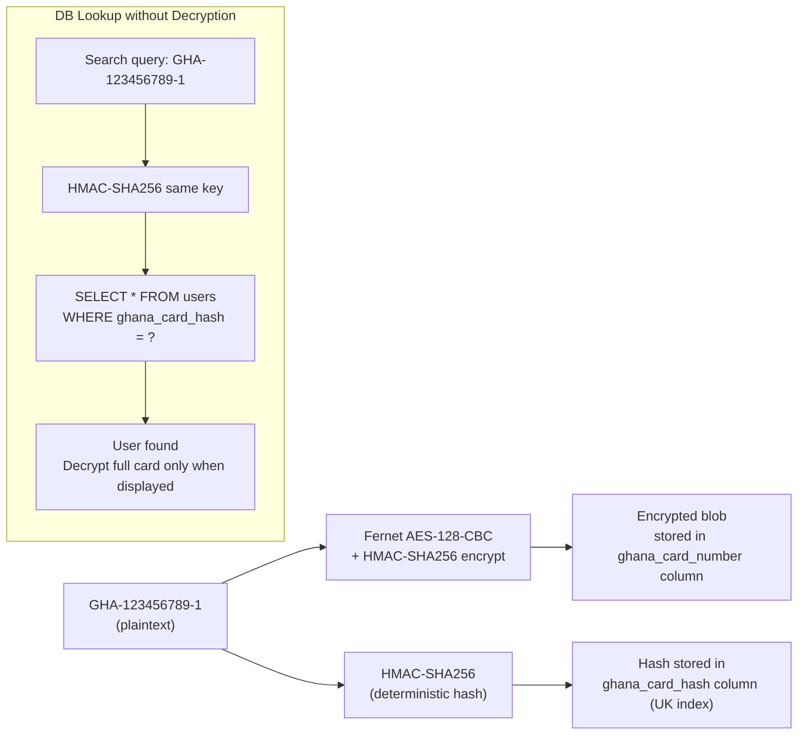

# 11 — Ghana Card Verification Flow

Identity verification using the National Identification Authority (NIA) Ghana Card format with optional face matching.

```mermaid
flowchart TD
    START(["User reaches Step 2\nParent / Informant Identity"]) --> INPUT["Enter Ghana Card Number\nFormat: GHA-XXXXXXXXX-X"]

    INPUT --> FORMAT_CHECK{Regex validation\nGHA-[0-9]{9}-[0-9]}
    FORMAT_CHECK -->|Invalid| FORMAT_ERR["Error: Invalid format\nExample: GHA-123456789-1"]
    FORMAT_ERR --> INPUT

    FORMAT_CHECK -->|Valid| NIA_CHECK{NIA API\nor mock DB lookup}
    NIA_CHECK -->|Found| CARD_MATCH["Card holder details returned\nFirst name, last name, DOB, region"]
    NIA_CHECK -->|Not found| NIA_ERR["Card number not found\nPlease check and re-enter"]
    NIA_ERR --> INPUT

    CARD_MATCH --> DISPLAY["Show card holder summary\nUser confirms identity"]
    DISPLAY --> SELFIE_STEP["Step: Take selfie\nOr upload recent photo"]

    SELFIE_STEP --> FACE_ENABLED{VITE_FACE_API_ENABLED\n== true?}

    FACE_ENABLED -->|Yes — face-api.js loaded| AI_COMPARE["Client-side face comparison\nface-api.js detectAllFaces()\neuclid distance similarity"]
    AI_COMPARE --> SCORE{Similarity\nscore >= 0.70?}
    SCORE -->|No — faces don't match| MISMATCH["Error: Face does not match\ncard photo — retry"]
    MISMATCH --> SELFIE_STEP
    SCORE -->|Yes| VERIFIED["Identity Verified\nGhana Card + face match"]

    FACE_ENABLED -->|No — disabled| MANUAL_FLAG["Manual review flag set\nStaff verifies photo vs card\nduring document review"]
    MANUAL_FLAG --> VERIFIED

    VERIFIED --> ENCRYPT["Ghana Card number\nFernet-encrypted in backend\nHMAC-SHA256 lookup index stored"]
    ENCRYPT --> PROCEED["Proceed to document upload\nStep 3"]
```

---

## PII Encryption Detail



---

## Ghana Card Number Format

```
GHA - XXXXXXXXX - X
 │        │        │
 │        │        └─ Check digit (0-9)
 │        └─ 9-digit national ID number
 └─ Country code prefix (Ghana)

Valid examples:
  GHA-000000001-1
  GHA-123456789-0
  GHA-987654321-5
```
