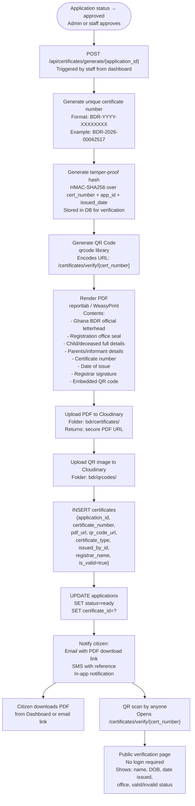
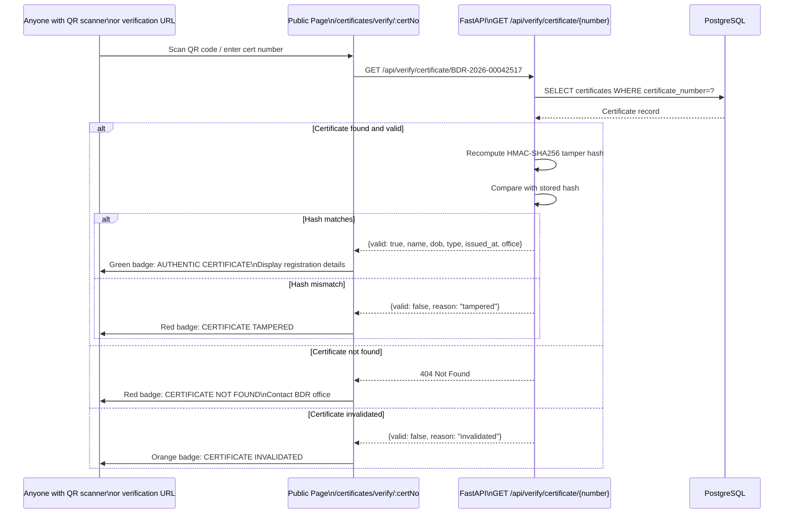

# 12 — Certificate Generation & Verification Flow

PDF certificate generation with QR code and public tamper-proof verification.



---

## Public Certificate Verification



---

## Certificate Number Format

```
BDR - YYYY - XXXXXXXX
 │      │        │
 │      │        └─ 8-digit zero-padded sequential ID
 │      └─ 4-digit year of issue
 └─ Births & Deaths Registry prefix

Birth certificate:  BDR-2026-00042517
Death certificate:  BDR-2026-00042518
```
