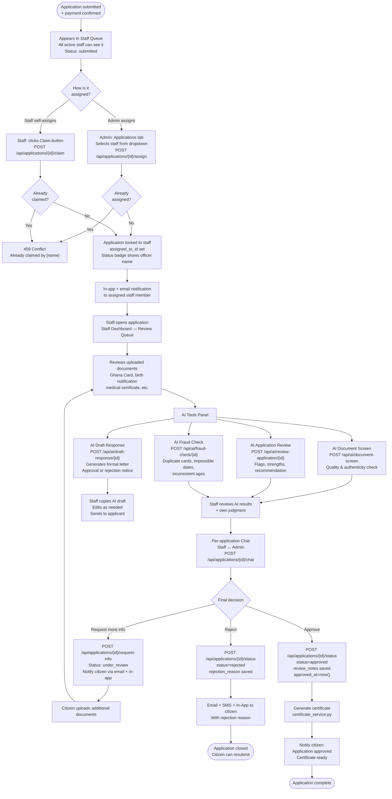
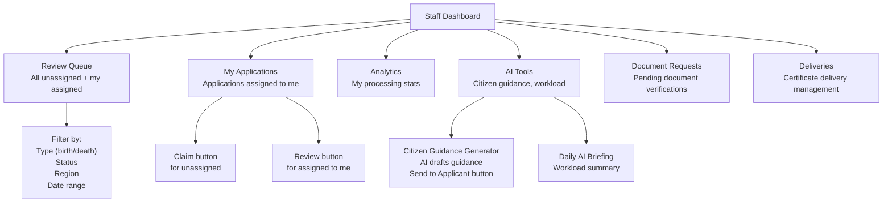

# 13 — Staff Task Assignment & Collaboration Flow

Application assignment, claiming, AI-assisted review, and decision workflow for BDR staff.

```mermaid
flowchart TD
    SUBMITTED(["Application submitted\n+ payment confirmed"]) --> QUEUE["Appears in Staff Queue\nAll active staff can see it\nStatus: submitted"]

    QUEUE --> ASSIGN_METHOD{How is it\nassigned?}

    ASSIGN_METHOD -->|"Admin assigns"| ADMIN_FLOW["Admin: Applications tab\nSelects staff from dropdown\nPOST /api/applications/{id}/assign"]
    ASSIGN_METHOD -->|"Staff self-assigns"| CLAIM_FLOW["Staff: clicks Claim button\nPOST /api/applications/{id}/claim"]

    ADMIN_FLOW --> CONFLICT_CHECK_A{Already\nassigned?}
    CONFLICT_CHECK_A -->|Yes| CONFLICT_ERR["409 Conflict\nAlready claimed by [name]"]
    CONFLICT_CHECK_A -->|No| LOCKED

    CLAIM_FLOW --> CONFLICT_CHECK_S{Already\nclaimed?}
    CONFLICT_CHECK_S -->|Yes| CONFLICT_ERR
    CONFLICT_CHECK_S -->|No| LOCKED

    LOCKED["Application locked to staff\nassigned_to_id set\nStatus badge shows officer name"] --> NOTIF_STAFF["In-app + email notification\nto assigned staff member"]

    NOTIF_STAFF --> STAFF_OPENS["Staff opens application\nStaff Dashboard — Review Queue"]

    STAFF_OPENS --> DOCS_REVIEW["Reviews uploaded documents\nGhana Card, birth notification\nmedical certificate, etc."]

    DOCS_REVIEW --> AI_TOOLS["AI Tools Panel"]

    AI_TOOLS --> AI1["AI Document Screen\nPOST /api/ai/document-screen\nQuality & authenticity check"]
    AI_TOOLS --> AI2["AI Application Review\nPOST /api/ai/review-application/{id}\nFlags, strengths, recommendation"]
    AI_TOOLS --> AI3["AI Fraud Check\nPOST /api/ai/fraud-check/{id}\nDuplicate cards, impossible dates,\ninconsistent ages"]
    AI_TOOLS --> AI4["AI Draft Response\nPOST /api/ai/draft-response/{id}\nGenerates formal letter\nApproval or rejection notice"]

    AI1 --> REVIEW_RESULT
    AI2 --> REVIEW_RESULT
    AI3 --> REVIEW_RESULT
    AI4 --> DRAFT_LETTER["Staff copies AI draft\nEdits as needed\nSends to applicant"]

    REVIEW_RESULT["Staff reviews AI results\n+ own judgment"] --> CHAT["Per-application Chat\nStaff ↔ Admin\nPOST /api/applications/{id}/chat"]
    CHAT --> DECISION{Final decision}

    DECISION -->|"Request more info"| REQUEST_INFO["POST /api/applications/{id}/request-info\nStatus: under_review\nNotify citizen via email + in-app"]
    REQUEST_INFO --> CITIZEN_UPLOADS["Citizen uploads additional documents"]
    CITIZEN_UPLOADS --> DOCS_REVIEW

    DECISION -->|"Reject"| REJECT["POST /api/applications/{id}/status\nstatus=rejected\nrejection_reason saved"]
    REJECT --> NOTIFY_REJECT["Email + SMS + In-App to citizen\nWith rejection reason"]
    NOTIFY_REJECT --> CLOSED1(["Application closed\nCitizen can resubmit"])

    DECISION -->|"Approve"| APPROVE["POST /api/applications/{id}/status\nstatus=approved\nreview_notes saved\napproved_at=now()"]
    APPROVE --> CERT_TRIGGER["Generate certificate\ncertificate_service.py"]
    CERT_TRIGGER --> NOTIFY_APPROVE["Notify citizen:\nApplication approved\nCertificate ready"]
    NOTIFY_APPROVE --> CLOSED2(["Application complete"])
```

---

## Staff Dashboard Sections

```mermaid
graph TD
    STAFF_DASH["Staff Dashboard"] --> QUEUE_TAB["Review Queue\nAll unassigned + my assigned"]
    STAFF_DASH --> MY_APPS["My Applications\nApplications assigned to me"]
    STAFF_DASH --> ANALYTICS_TAB["Analytics\nMy processing stats"]
    STAFF_DASH --> AI_TAB["AI Tools\nCitizen guidance, workload"]
    STAFF_DASH --> DOCS_TAB["Document Requests\nPending document verifications"]
    STAFF_DASH --> DELIVERY_TAB["Deliveries\nCertificate delivery management"]

    QUEUE_TAB --> FILTER["Filter by:\nType (birth/death)\nStatus\nRegion\nDate range"]
    MY_APPS --> CLAIM["Claim button\nfor unassigned"]
    MY_APPS --> REVIEW_BTN["Review button\nfor assigned to me"]
    AI_TAB --> CITIZEN_GUIDE["Citizen Guidance Generator\nAI drafts guidance\nSend to Applicant button"]
    AI_TAB --> BRIEFING["Daily AI Briefing\nWorkload summary"]
```
