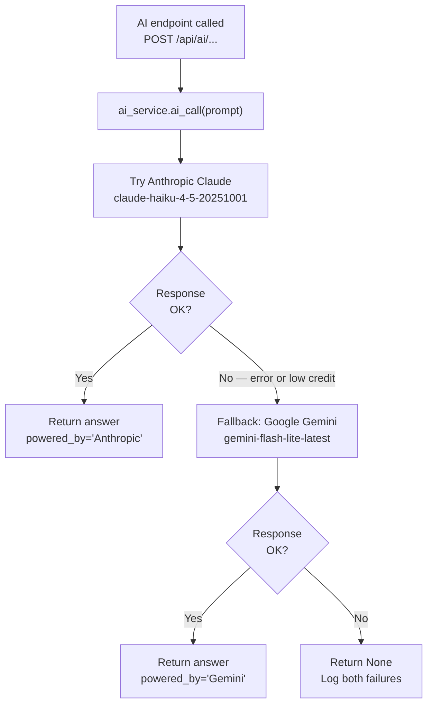
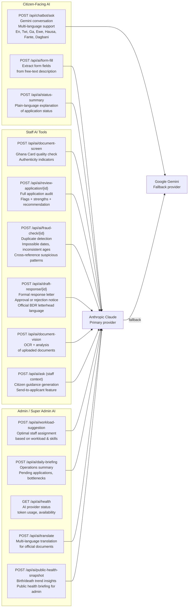
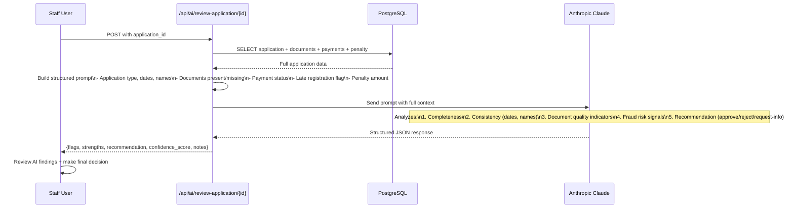

# 14 — AI Automation Architecture

AI-powered features using Anthropic Claude and Google Gemini with automatic provider fallback.

## Provider Fallback Logic

---

## AI Endpoints by Role

---

## AI Review Application — Internal Logic

---

## Chatbot System Prompt

The BDR Chatbot (ChatbotWidget.jsx) uses a system prompt with these constraints:

- Answers in the language selected by the user (English, Twi, Ga, Ewe, Hausa, Fante, Dagbani)
- Covers: registration requirements, fees, timelines, document checklists, office locations
- Plain prose only — no markdown symbols (CRITICAL FORMATTING RULE enforced in backend prompt)
- Conversation history limited to last 10 messages for context window efficiency
