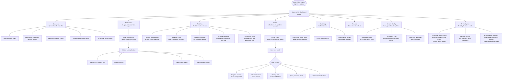

# 15 — Super Admin Control Flow

System-wide administration dashboard — user management, analytics, audit, and AI intelligence.

```mermaid
flowchart TD
    SA_LOGIN(["Super Admin logs in\n/signin → /admin"]) --> SA_DASH["Super Admin Dashboard\n/admin"]

    SA_DASH --> OVERVIEW_TAB["Overview\nSystem health snapshot"]
    SA_DASH --> APPLICATIONS_TAB["Applications\nAll applications system-wide"]
    SA_DASH --> ANALYTICS_TAB["Analytics\nMonthly charts + trends"]
    SA_DASH --> USERS_TAB["Users\nAll citizen, staff, admin accounts"]
    SA_DASH --> AUDIT_TAB["Audit Log\nFull action trail"]
    SA_DASH --> REPORTS_TAB["Reports\nGenerate + download"]
    SA_DASH --> SYSTEM_TAB["System Config\nFees, penalties, templates"]
    SA_DASH --> AI_TAB["AI Intelligence\nRegistry AI chat + health"]

    OVERVIEW_TAB --> OV1["Total registered users"]
    OVERVIEW_TAB --> OV2["Applications this month\n(birth vs death)"]
    OVERVIEW_TAB --> OV3["Revenue collected (GHS)"]
    OVERVIEW_TAB --> OV4["Pending applications count"]
    OVERVIEW_TAB --> OV5["AI provider health status"]

    APPLICATIONS_TAB --> APP_FILTER["Filter: type, status,\nregion, date range, staff"]
    APP_FILTER --> APP_ACTIONS["Actions per application"]
    APP_ACTIONS --> REASSIGN["Reassign to different staff"]
    APP_ACTIONS --> FORCE_STATUS["Override status"]
    APP_ACTIONS --> VIEW_ALL_DOCS["View all documents"]
    APP_ACTIONS --> VIEW_PAYMENTS["View payment history"]

    ANALYTICS_TAB --> MONTHLY["Monthly Registrations\nBirth vs Death line chart"]
    ANALYTICS_TAB --> REVENUE["Revenue Chart\nFees + penalties by month"]
    ANALYTICS_TAB --> REGIONAL["Regional Heatmap\nAll 16 Ghana regions"]
    ANALYTICS_TAB --> STAFF_PERF["Staff Performance\nApplications processed, avg time"]
    ANALYTICS_TAB --> PROC_TIME["Processing Time\nAverage days per application type"]

    USERS_TAB --> LIST_USERS["List all users\nFilter by role, status, region"]
    LIST_USERS --> VIEW_USER["View user profile"]
    VIEW_USER --> USER_ACTIONS{"User actions"}
    USER_ACTIONS --> SUSPEND["Suspend account\nstatus=suspended"]
    USER_ACTIONS --> ACTIVATE["Activate account\nstatus=active"]
    USER_ACTIONS --> CHANGE_ROLE["Change role\ncitizen/staff/admin"]
    USER_ACTIONS --> FORCE_RESET["Force password reset"]
    USER_ACTIONS --> VIEW_USER_APPS["View user's applications"]

    AUDIT_TAB --> AUDIT_FILTER["Filter: user, action, entity,\ndate range, IP address"]
    AUDIT_TAB --> EXPORT_CSV["Export audit log CSV"]
    AUDIT_TAB --> REALTIME["Real-time log entries\nWebSocket-powered"]

    SYSTEM_TAB --> FEE_CFG["Registration fees\nbirth GHS / death GHS"]
    SYSTEM_TAB --> PENALTY_CFG["Late penalty rules\ndays threshold, amount per month"]
    SYSTEM_TAB --> EMAIL_TMPL["Email/SMS templates\nJinja2 variables"]

    AI_TAB --> AI_HEALTH["AI Provider Health Cards\nAnthropic: token usage, status\nGemini: quota, status"]
    AI_TAB --> AI_CHAT["Registry AI Chat\nAsk questions about operations"]
    AI_TAB --> PH_SNAPSHOT["Public Health Snapshot\nAI-generated birth/death insights\nEpidemiological summary"]
```
