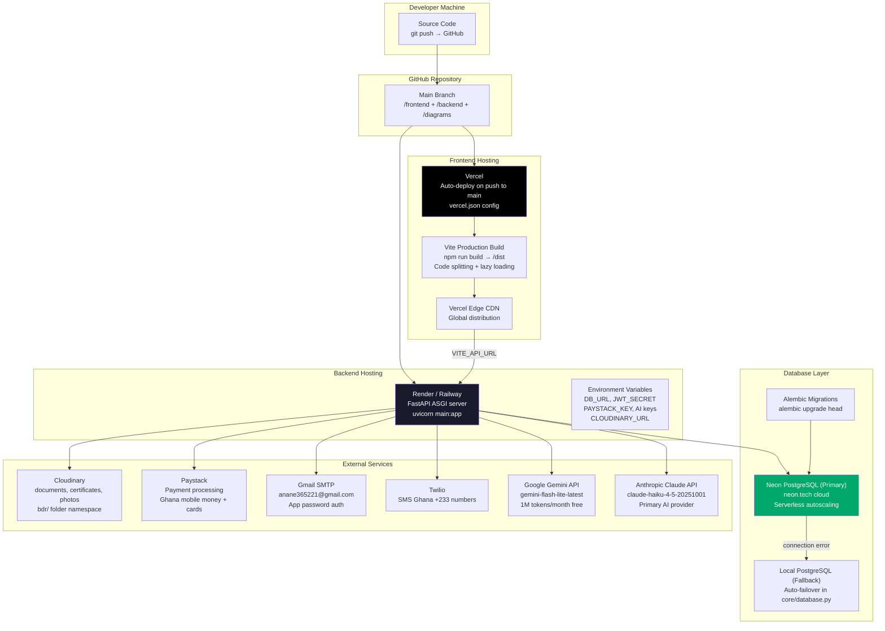

# 16 — Deployment Architecture

Infrastructure and hosting configuration for the Ghana BDR platform.

---

## Environment Variables

### Backend (.env)

| Variable | Description |
|----------|-------------|
| `DATABASE_URL` | Neon PostgreSQL connection string |
| `FALLBACK_DATABASE_URL` | Local PostgreSQL fallback |
| `JWT_SECRET_KEY` | JWT signing secret |
| `JWT_ALGORITHM` | HS256 |
| `ACCESS_TOKEN_EXPIRE_MINUTES` | 30 |
| `REFRESH_TOKEN_EXPIRE_DAYS` | 7 |
| `PAYSTACK_SECRET_KEY` | Paystack secret key |
| `PAYSTACK_PUBLIC_KEY` | Paystack public key |
| `ANTHROPIC_API_KEY` | Claude API key |
| `GEMINI_API_KEY` | Google Gemini API key |
| `CLOUDINARY_CLOUD_NAME` | Cloudinary cloud name |
| `CLOUDINARY_API_KEY` | Cloudinary API key |
| `CLOUDINARY_API_SECRET` | Cloudinary API secret |
| `SMTP_HOST` | smtp.gmail.com |
| `SMTP_PORT` | 587 |
| `SMTP_USERNAME` | Gmail address |
| `SMTP_PASSWORD` | Gmail app password |
| `TWILIO_ACCOUNT_SID` | Twilio SID |
| `TWILIO_AUTH_TOKEN` | Twilio auth token |
| `TWILIO_PHONE_NUMBER` | Sender phone |
| `FERNET_KEY` | AES encryption key for PII |

### Frontend (.env)

| Variable | Description |
|----------|-------------|
| `VITE_API_URL` | Backend base URL |
| `VITE_PAYSTACK_PUBLIC_KEY` | Paystack public key |
| `VITE_NIA_API_URL` | NIA Ghana Card API |
| `VITE_NIA_API_KEY` | NIA API key |
| `VITE_FACE_API_ENABLED` | Enable client-side face matching |
| `VITE_GOOGLE_CLIENT_ID` | Google OAuth client ID |
