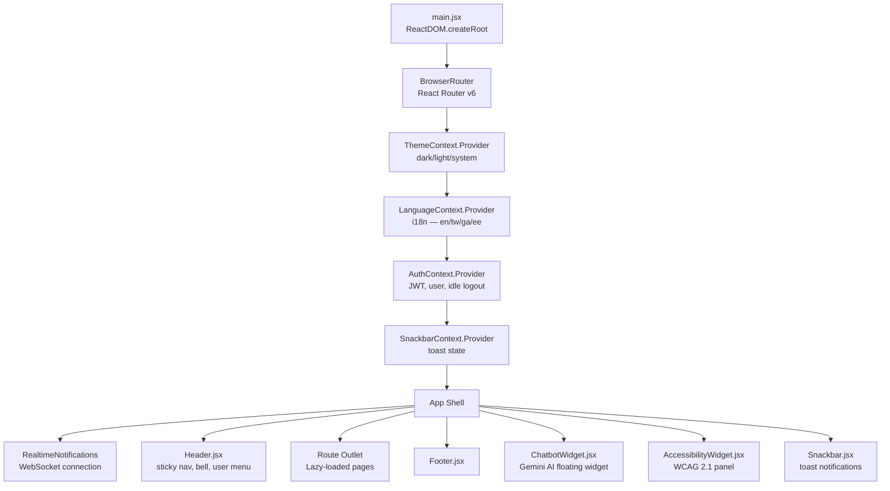
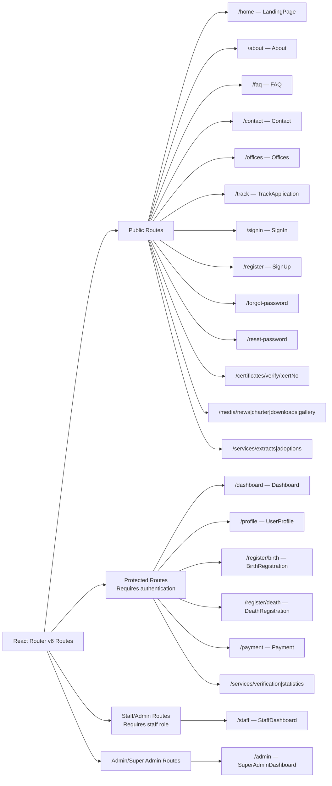
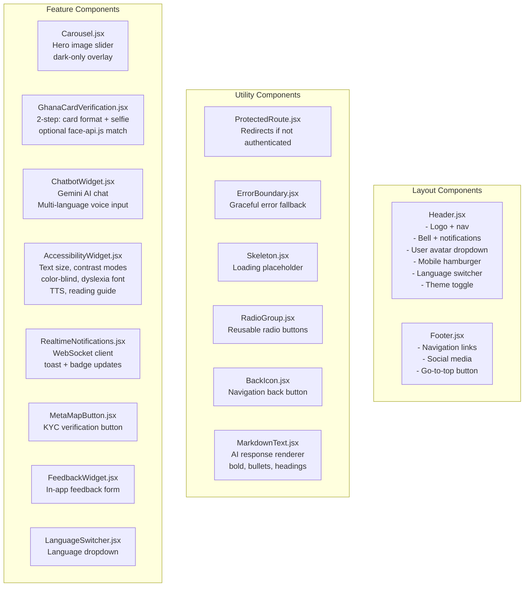

# 17 — Frontend Component Tree

React component hierarchy, routing structure, and context providers.

## App Bootstrap & Context Providers

---

## Route Tree

---

## Shared Components

---

## Page Components by Feature Area

| Area | Page | Route | Auth Required |
|------|------|-------|---------------|
| Public | LandingPage | /home | No |
| Auth | SignIn, SignUp, ForgotPassword, ResetPassword | /signin, /register, ... | No |
| Registration | BirthRegistration, DeathRegistration | /register/birth, /register/death | Yes |
| Tracking | TrackApplication | /track | No (own data requires auth) |
| Payments | Payment | /payment | Yes |
| Dashboard | Dashboard (citizen) | /dashboard | Yes |
| Dashboard | StaffDashboard | /staff | Staff+ |
| Dashboard | SuperAdminDashboard | /admin | Super Admin |
| Profile | UserProfile | /profile | Yes |
| Certificates | CertificateVerify | /certificates/verify/:certNo | No (public) |
| Info | About, FAQ, Contact, Offices | /about, /faq, ... | No |
| Media | MediaNews, MediaCharter, MediaDownloads, MediaGallery | /media/... | No |
| Services | ServiceExtracts, ServiceAdoptions, ServiceVerification, ServiceStatistics | /services/... | Mixed |
