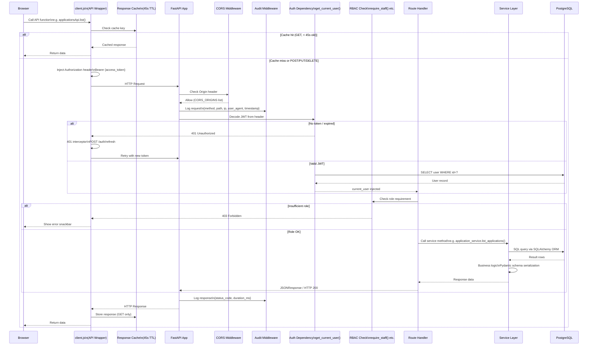
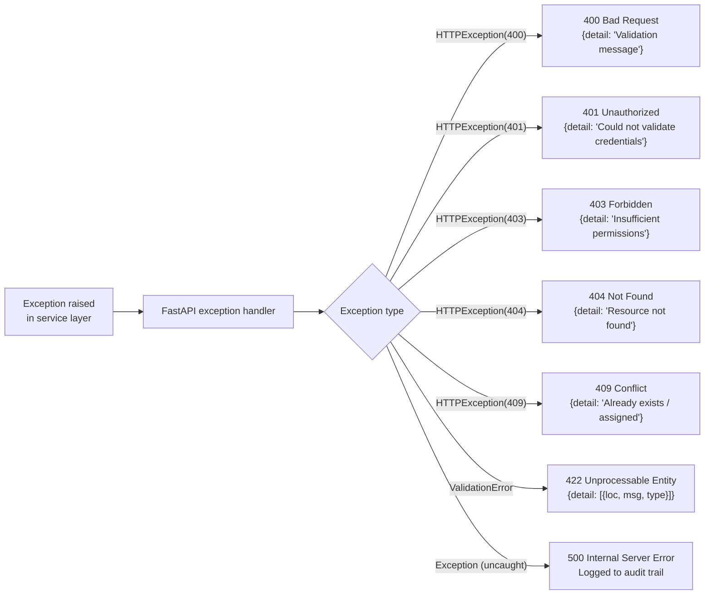

# 18 — API Request Lifecycle

Full journey of an HTTP request from browser to database and back.

---

## Error Response Structure

---

## Request Caching Strategy (client.js)

| Method | Cached? | TTL | Invalidation |
|--------|---------|-----|-------------|
| GET | Yes | 45 seconds | Manual `clearApiCache()` |
| POST | No | — | Clears related GET cache |
| PUT | No | — | Clears related GET cache |
| DELETE | No | — | Clears related GET cache |
| WebSocket | N/A | — | Persistent connection |
