# 19 — Use Case Diagram

UML-style use cases for all 4 actors in the Ghana BDR system.

```mermaid
graph LR
    subgraph ACTORS["Actors"]
        CITIZEN(["Citizen\n(Registrant)"])
        STAFF_ACT(["Staff Officer"])
        ADMIN_ACT(["Admin"])
        SUPER_ACT(["Super Admin"])
        PAYSTACK_ACT(["Paystack\n(External)"])
        AI_ACT(["AI Provider\n(Claude/Gemini)"])
    end

    subgraph CITIZEN_UC["Citizen Use Cases"]
        UC1["Register account\n& verify email"]
        UC2["Login with email\nor Google OAuth"]
        UC3["Submit birth registration"]
        UC4["Submit death registration"]
        UC5["Upload supporting documents"]
        UC6["Pay registration fees"]
        UC7["Track application status"]
        UC8["Download certificate"]
        UC9["Use AI chatbot\nfor guidance"]
        UC10["Update profile\n& accessibility prefs"]
        UC11["Receive notifications\n(email, SMS, in-app)"]
        UC12["Verify certificate (public)"]
    end

    subgraph STAFF_UC["Staff Use Cases"]
        UC13["Review application queue"]
        UC14["Claim or receive assignment"]
        UC15["Review uploaded documents"]
        UC16["Run AI document screen"]
        UC17["Run AI application review"]
        UC18["Run AI fraud check"]
        UC19["Generate AI draft response"]
        UC20["Request additional documents"]
        UC21["Approve or reject application"]
        UC22["Chat with admin\nper application"]
        UC23["Process delivery"]
        UC24["View staff analytics"]
    end

    subgraph ADMIN_UC["Admin Use Cases"]
        UC25["Assign applications to staff"]
        UC26["Override application status"]
        UC27["Issue certificate"]
        UC28["Waive late penalty"]
        UC29["Run AI workload suggestion"]
        UC30["Generate daily AI briefing"]
        UC31["View revenue analytics"]
        UC32["Manage staff accounts"]
        UC33["Generate reports"]
    end

    subgraph SUPER_UC["Super Admin Use Cases"]
        UC34["Manage all users\n(create, suspend, role change)"]
        UC35["System-wide analytics"]
        UC36["View full audit log"]
        UC37["Configure fees & penalties"]
        UC38["Use AI Intelligence dashboard"]
        UC39["View public health snapshot"]
        UC40["Override any application"]
    end

    CITIZEN --> UC1
    CITIZEN --> UC2
    CITIZEN --> UC3
    CITIZEN --> UC4
    CITIZEN --> UC5
    CITIZEN --> UC6
    CITIZEN --> UC7
    CITIZEN --> UC8
    CITIZEN --> UC9
    CITIZEN --> UC10
    CITIZEN --> UC11
    CITIZEN --> UC12

    STAFF_ACT --> UC13
    STAFF_ACT --> UC14
    STAFF_ACT --> UC15
    STAFF_ACT --> UC16
    STAFF_ACT --> UC17
    STAFF_ACT --> UC18
    STAFF_ACT --> UC19
    STAFF_ACT --> UC20
    STAFF_ACT --> UC21
    STAFF_ACT --> UC22
    STAFF_ACT --> UC23
    STAFF_ACT --> UC24

    ADMIN_ACT --> UC25
    ADMIN_ACT --> UC26
    ADMIN_ACT --> UC27
    ADMIN_ACT --> UC28
    ADMIN_ACT --> UC29
    ADMIN_ACT --> UC30
    ADMIN_ACT --> UC31
    ADMIN_ACT --> UC32
    ADMIN_ACT --> UC33

    SUPER_ACT --> UC34
    SUPER_ACT --> UC35
    SUPER_ACT --> UC36
    SUPER_ACT --> UC37
    SUPER_ACT --> UC38
    SUPER_ACT --> UC39
    SUPER_ACT --> UC40

    UC6 --> PAYSTACK_ACT
    UC9 --> AI_ACT
    UC16 --> AI_ACT
    UC17 --> AI_ACT
    UC18 --> AI_ACT
    UC19 --> AI_ACT
    UC29 --> AI_ACT
    UC30 --> AI_ACT
    UC38 --> AI_ACT
    UC39 --> AI_ACT
```

---

## Actor Summary

| Actor | Primary Goal | Access Level |
|-------|-------------|-------------|
| Citizen | Register births/deaths, pay fees, receive certificates | Authenticated — own data only |
| Staff Officer | Process applications, verify documents, use AI tools | Staff role |
| Admin | Approve/reject, issue certificates, manage staff, analytics | Admin role |
| Super Admin | Full system control, configuration, user management | Super Admin role |
| Paystack | Process payments, send webhooks | External API |
| AI Provider | Claude/Gemini — form extraction, review, fraud, chatbot | External API |
