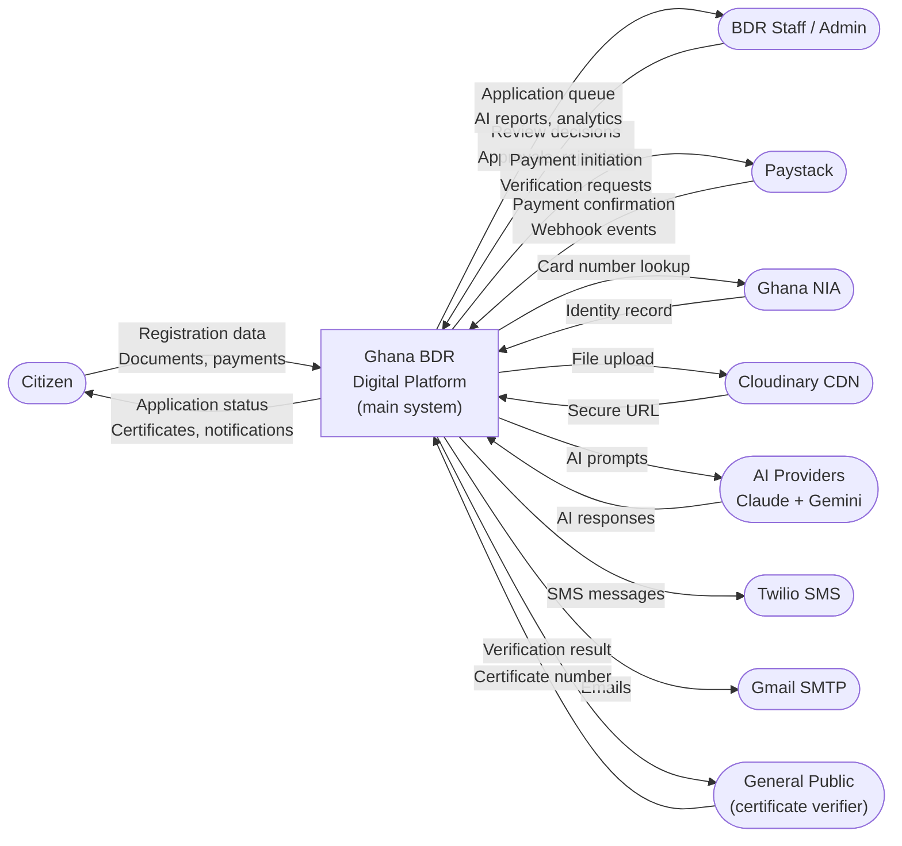

# 20 — Data Flow Diagram (DFD)

Level-0 context diagram and Level-1 DFD for the Ghana BDR system.

## Level-0 — Context Diagram

```mermaid
graph LR
    CITIZEN_EXT(["Citizen"])
    STAFF_EXT(["BDR Staff / Admin"])
    PAYSTACK_EXT(["Paystack"])
    NIA_EXT(["Ghana NIA"])
    CLOUDINARY_EXT(["Cloudinary CDN"])
    AI_EXT(["AI Providers\nClaude + Gemini"])
    TWILIO_EXT(["Twilio SMS"])
    GMAIL_EXT(["Gmail SMTP"])
    PUBLIC_EXT(["General Public\n(certificate verifier)"])

    BDR_SYSTEM["Ghana BDR\nDigital Platform\n(main system)"]

    CITIZEN_EXT -->|"Registration data\nDocuments, payments"| BDR_SYSTEM
    BDR_SYSTEM -->|"Application status\nCertificates, notifications"| CITIZEN_EXT

    STAFF_EXT -->|"Review decisions\nApprovals, rejections"| BDR_SYSTEM
    BDR_SYSTEM -->|"Application queue\nAI reports, analytics"| STAFF_EXT

    BDR_SYSTEM -->|"Payment initiation\nVerification requests"| PAYSTACK_EXT
    PAYSTACK_EXT -->|"Payment confirmation\nWebhook events"| BDR_SYSTEM

    BDR_SYSTEM -->|"Card number lookup"| NIA_EXT
    NIA_EXT -->|"Identity record"| BDR_SYSTEM

    BDR_SYSTEM -->|"File upload"| CLOUDINARY_EXT
    CLOUDINARY_EXT -->|"Secure URL"| BDR_SYSTEM

    BDR_SYSTEM -->|"AI prompts"| AI_EXT
    AI_EXT -->|"AI responses"| BDR_SYSTEM

    BDR_SYSTEM -->|"SMS messages"| TWILIO_EXT
    BDR_SYSTEM -->|"Emails"| GMAIL_EXT

    PUBLIC_EXT -->|"Certificate number"| BDR_SYSTEM
    BDR_SYSTEM -->|"Verification result"| PUBLIC_EXT
```

---

## Level-1 — Major Processes

```mermaid
graph TB
    subgraph INPUTS["External Inputs"]
        CI_IN(["Citizen inputs"])
        STAFF_IN(["Staff inputs"])
        PAY_WH(["Paystack webhook"])
    end

    subgraph PROC1["P1: User Management"]
        REG["1.1 Register & verify"]
        LOGIN["1.2 Authenticate (JWT)"]
        PROFILE["1.3 Manage profile"]
    end

    subgraph PROC2["P2: Application Processing"]
        CREATE["2.1 Create application\n(birth/death form data)"]
        VALIDATE_APP["2.2 Validate & fee calc\n(penalty check)"]
        SUBMIT_APP["2.3 Submit application"]
        REVIEW_APP["2.4 Staff review\n(approve/reject/request)"]
    end

    subgraph PROC3["P3: Payment Processing"]
        INIT_PAY["3.1 Initiate payment"]
        VERIFY_PAY["3.2 Verify payment"]
        RECEIPT["3.3 Generate receipt"]
    end

    subgraph PROC4["P4: Document Management"]
        UPLOAD_DOC["4.1 Upload document\nCloudinary"]
        VERIFY_DOC["4.2 Staff verifies\ndocument"]
    end

    subgraph PROC5["P5: Certificate Issuance"]
        GEN_CERT["5.1 Generate PDF + QR"]
        DIST_CERT["5.2 Deliver / ready\nfor collection"]
        VERIFY_CERT["5.3 Public verification"]
    end

    subgraph PROC6["P6: Notification Dispatch"]
        NOTIF_IN_APP["6.1 In-app / WebSocket"]
        NOTIF_EMAIL["6.2 Email (SMTP)"]
        NOTIF_SMS["6.3 SMS (Twilio)"]
    end

    subgraph PROC7["P7: AI Services"]
        CHATBOT_PROC["7.1 Chatbot Q&A"]
        REVIEW_AI["7.2 Application review AI"]
        FRAUD_AI["7.3 Fraud detection AI"]
        DRAFT_AI["7.4 Response drafting AI"]
    end

    subgraph STORES["Data Stores"]
        DS1[("D1: Users")]
        DS2[("D2: Applications")]
        DS3[("D3: Payments")]
        DS4[("D4: Documents\n(Cloudinary + DB)")]
        DS5[("D5: Certificates")]
        DS6[("D6: Notifications")]
        DS7[("D7: Audit Logs")]
    end

    CI_IN --> REG
    CI_IN --> LOGIN
    CI_IN --> CREATE
    CI_IN --> UPLOAD_DOC
    CI_IN --> INIT_PAY
    CI_IN --> CHATBOT_PROC

    STAFF_IN --> REVIEW_APP
    STAFF_IN --> VERIFY_DOC
    STAFF_IN --> GEN_CERT
    STAFF_IN --> REVIEW_AI

    PAY_WH --> VERIFY_PAY

    REG --> DS1
    LOGIN --> DS1
    CREATE --> DS2
    VALIDATE_APP --> DS2
    SUBMIT_APP --> DS2
    REVIEW_APP --> DS2
    INIT_PAY --> DS3
    VERIFY_PAY --> DS3
    UPLOAD_DOC --> DS4
    VERIFY_DOC --> DS4
    GEN_CERT --> DS5
    NOTIF_IN_APP --> DS6
    REVIEW_APP --> DS7

    VERIFY_PAY --> SUBMIT_APP
    REVIEW_APP --> GEN_CERT
    GEN_CERT --> NOTIF_IN_APP
    REVIEW_APP --> NOTIF_IN_APP
    NOTIF_IN_APP --> NOTIF_EMAIL
    NOTIF_IN_APP --> NOTIF_SMS

    REVIEW_APP --> REVIEW_AI
    REVIEW_APP --> FRAUD_AI
    REVIEW_AI --> DRAFT_AI

    GEN_CERT --> VERIFY_CERT
```
