# Ghana BDR Digital Platform — System Diagrams

## 1. System Architecture Overview

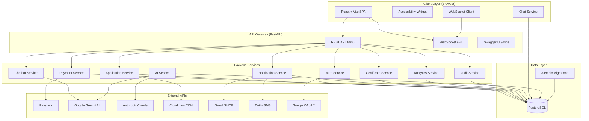

---

## 2. Enhanced Entity Relationship Diagram (EERD)

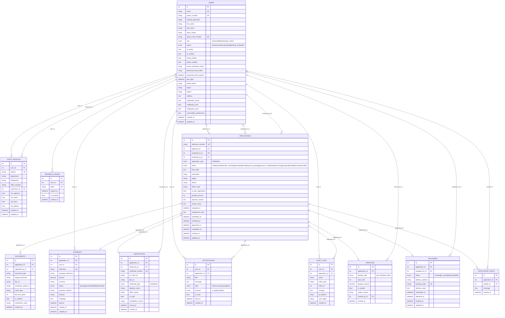

---

## 3. User Roles and Permissions Matrix

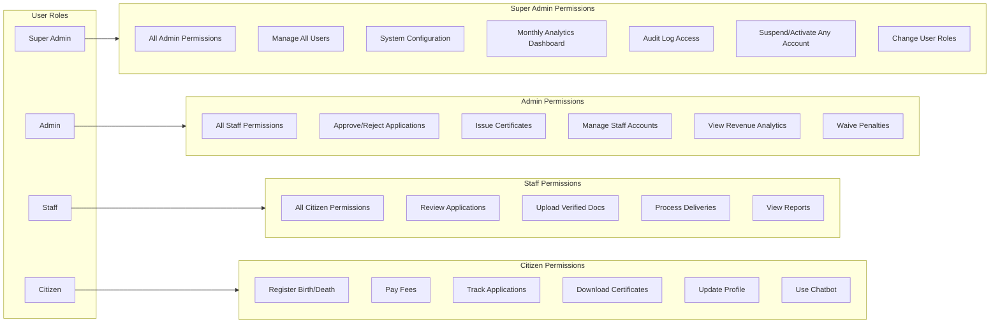

---

## 4. Main Application Flowchart — Birth Registration

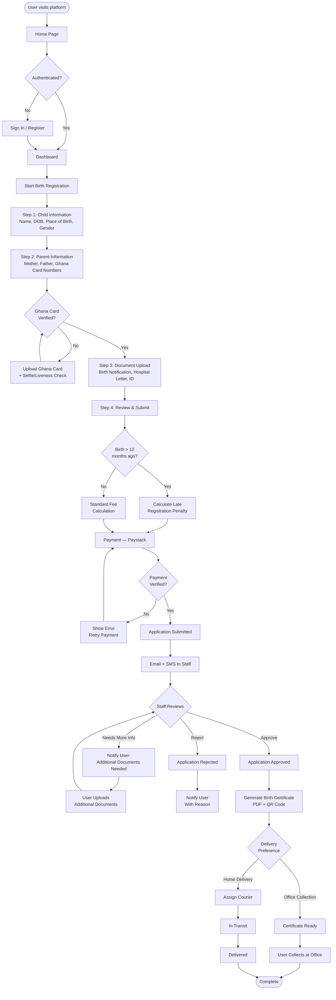

---

## 5. Death Registration Flowchart

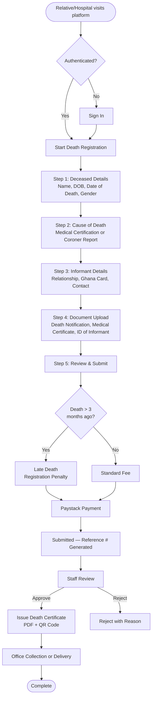

---

## 6. Authentication & Token Lifecycle

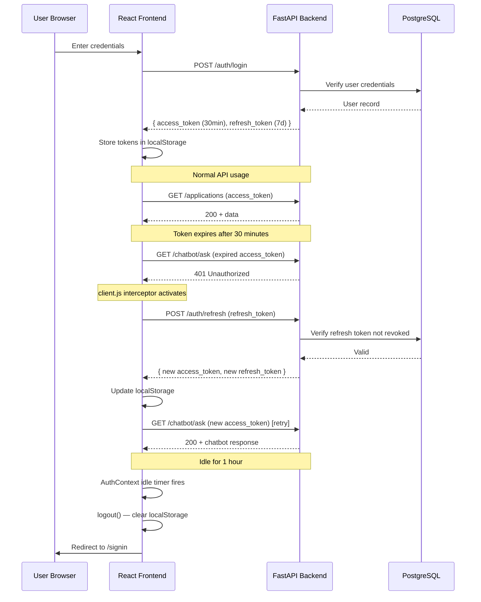

---

## 7. Payment Integration Flow

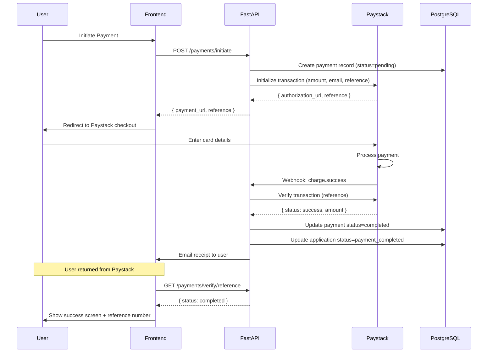

---

## 8. Super Admin Control Flow

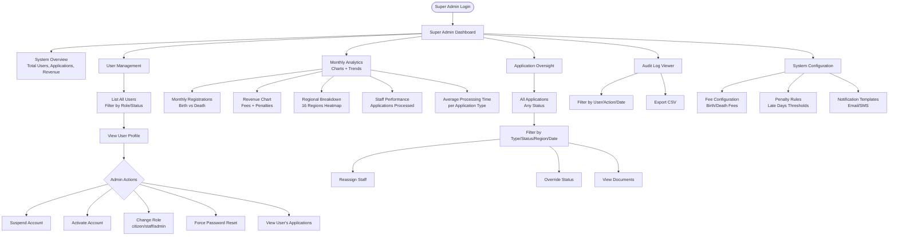

---

## 9. Notification System Flow

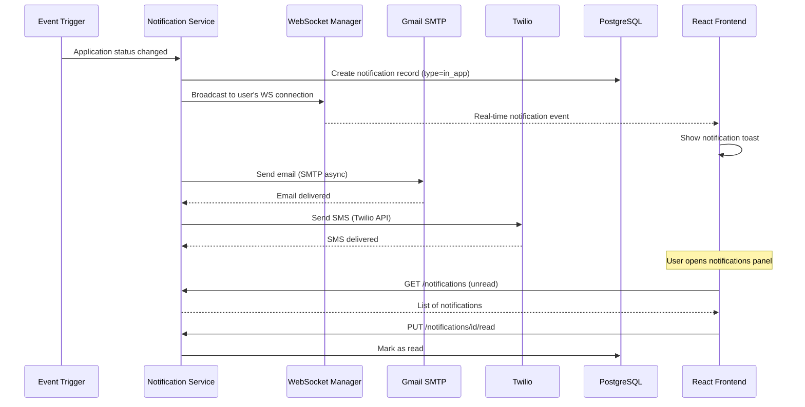

---

## 10. Document Upload and Verification Flow

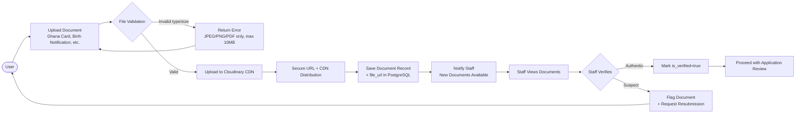

---

## 11. WebSocket Real-Time Architecture

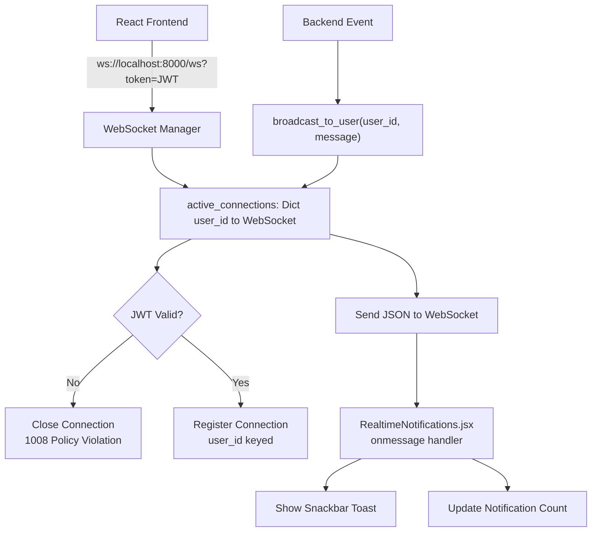

---

## 12. Ghana Card Verification Flow

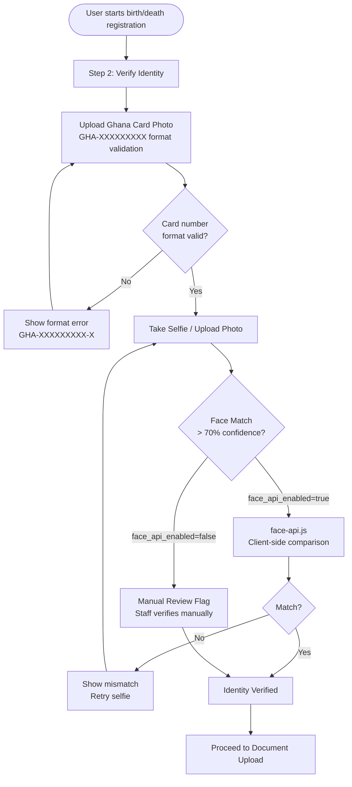

---

## 13. Certificate Generation Flow

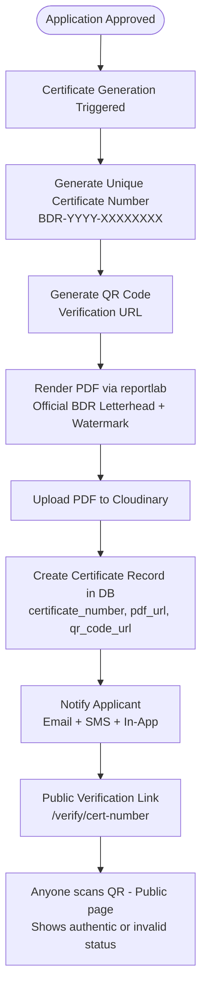

---

## 14. Staff Task Assignment & Collaboration Flow

```mermaid
flowchart TD
    SUBMIT([Application Submitted]) --> QUEUE[Appears in Staff Queue\nAll active staff can see it]
    QUEUE --> ASSIGN{How assigned?}

    ASSIGN -->|Admin assigns| ADMIN_ASSIGN[Admin: Applications tab\nAssign tab → select staff → save]
    ADMIN_ASSIGN --> NOTIFY_STAFF[Notification sent to staff\nIn-app + WebSocket]
    NOTIFY_STAFF --> LOCKED[Application shows as LOCKED\nOther staff see staff name badge]

    ASSIGN -->|Staff claims| CLAIM_BTN[Staff clicks Claim button\nPOST /applications/{id}/claim]
    CLAIM_BTN --> LOCK_CHECK{Already claimed\nby another?}
    LOCK_CHECK -->|Yes| CONFLICT[409 Conflict\nShows assigned staff name]
    LOCK_CHECK -->|No| LOCKED

    LOCKED --> CHAT[Admin & assigned staff\ncan chat per-application]
    LOCKED --> AI_REVIEW[Staff runs AI Review\nFlags, strengths, recommendation]
    AI_REVIEW --> FRAUD[Staff runs Fraud Check\nDuplicate cards, impossible dates]
    AI_REVIEW --> DRAFT[Staff drafts response letter\nAI generates formal letter]
    DRAFT --> DECISION[Staff updates status\nApproved/Rejected/Request Info]
    DECISION --> COMPLETE[Application marked done\nOther staff see completion badge]
```

---

## 15. AI Automation Architecture

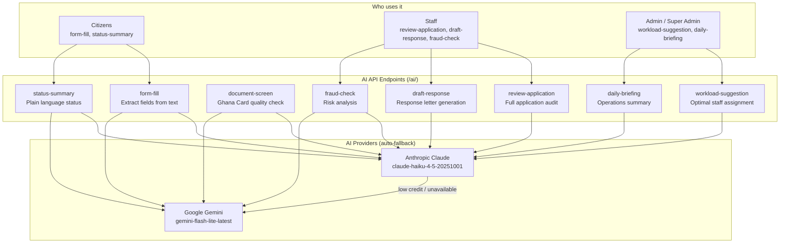
